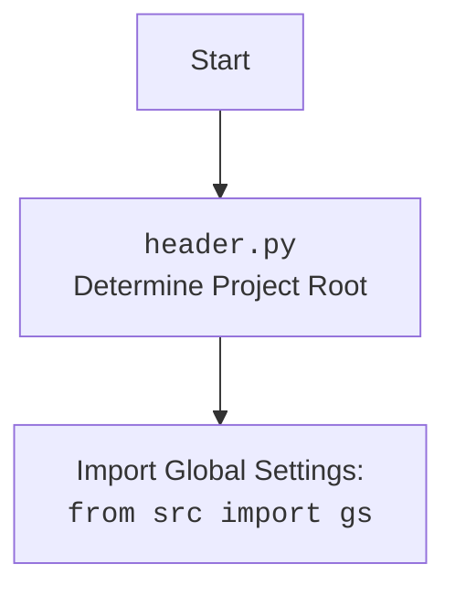

### **Analysis of `__init__.py`**

#### **<algorithm>**

1.  **Start**: The script begins execution.
2.  **Import Global Settings**: Imports the `gs` variable from the `src.gs` module.
    *   Example: `from .gs import gs` imports the global settings variable.
3.  **End**: The script finishes execution.

#### **<mermaid>**

```mermaid
flowchart TD
    Start --> ImportGlobalSettings[Import <code>gs</code> from <code>.gs</code> (<code>src/gs.py</code>)]
    ImportGlobalSettings --> End
```



**Analysis of dependencies**:

*   `src.gs`: This module is imported to access the global settings variable `gs`. It suggests that the `__init__.py` module is importing a resource that is initialized and configured elsewhere in the project.

#### **<explanation>**

*   **Imports**:
    *   `gs` from `.gs`: Imports the `gs` variable from the `src.gs` module. The dot (`.`) indicates a relative import, meaning it imports from a module within the same package.
        *   **Relationship**: `gs` from `src.gs` is a global variable, holding configuration parameters that are loaded from a `config.json` file. The import here establishes a dependency on the `src.gs` module.
*   **Classes**: None.
*   **Functions**: None.
*   **Variables**: None explicitly defined in this file, the global variable `gs` is imported.
    *   **Usage**: The global variable `gs` is imported so that the configuration data available in `src.gs` can be used by other modules using the `gemini_simplechat` package.
*   **Potential Errors/Improvements**:
    *   **Implicit Dependency**: This `__init__.py` file creates an implicit dependency on `src.gs.py`. If `src.gs.py` is not set up correctly or if the `config.json` file is not present or has errors, it will cause the initialization to fail.
    *   **Limited Functionality**: The `__init__.py` file currently only imports the global settings variable. It may be desirable to add further initialization logic or import other commonly used modules within this package.
    *   **Documentation**: The module documentation is minimal and should be expanded to explain the role of the imported `gs` variable within the package.
*   **Chain of Relationships**:
    *   This `__init__.py` is part of the `gemini_simplechat` package. It imports `gs` from `src.gs`, establishing a direct dependency.
    *   The imported `gs` variable likely impacts the behavior of other modules in the `gemini_simplechat` package. Thus, the initialization of `gs` in `src.gs` is critical to ensure all other modules operate correctly within the project.
    *   The `src.gs.py` depends on `src.header.py` to determine the root directory and locate the `config.json` file. Therefore, `__init__.py` has a transitive dependency on `src.header.py` as well.
    *   If the `config.json` file does not exist or is not configured correctly this will have a knock on effect to modules that import `gs`.

    In summary, the `__init__.py` file serves to import the `gs` variable, thereby making global settings accessible to the package. It establishes a chain of dependencies and the proper setup of `src.gs` and `src.header` is necessary for this module to function correctly.