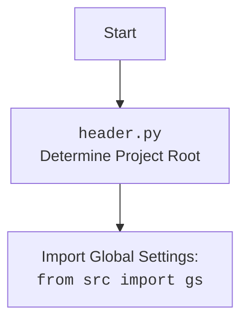

### **Analysis of `__init__.py` (within `src.ai`)**

#### **<algorithm>**

1.  **Start**: The script begins execution.
2.  **Import GoogleGenerativeAI Class**: Imports the `GoogleGenerativeAI` class from the `gemini.py` module within the same directory.
    *   Example: `from .gemini import GoogleGenerativeAI` imports the class.
3.  **End**: The script finishes execution.

#### **<mermaid>**

```mermaid
flowchart TD
    Start --> ImportGoogleGenerativeAI[Import <code>GoogleGenerativeAI</code> from <code>.gemini</code> (<code>gemini.py</code>)]
    ImportGoogleGenerativeAI --> End
```



**Analysis of dependencies**:

*   `gemini.py`: This module is imported to access the `GoogleGenerativeAI` class, which is presumably used for interacting with the Gemini AI model. It suggests that the `__init__.py` file is exposing the core class used for AI operations.

#### **<explanation>**

*   **Imports**:
    *   `GoogleGenerativeAI` from `.gemini`: Imports the `GoogleGenerativeAI` class from the `gemini.py` module located in the same directory. The dot (`.`) denotes a relative import, indicating that `gemini.py` is in the same directory as this `__init__.py` file.
        *   **Relationship**: The `GoogleGenerativeAI` class is part of the `src.ai` package. This import establishes a dependency on the `gemini.py` module, which likely implements the functionality for interacting with a Gemini AI model.
*   **Classes**: None.
*   **Functions**: None.
*   **Variables**: None.
*   **Potential Errors/Improvements**:
    *   **Implicit Dependency**: This file creates an implicit dependency on `gemini.py`. If `gemini.py` is not set up correctly or has errors, the import will fail.
    *   **Limited Functionality**:  The `__init__.py` file currently only imports the `GoogleGenerativeAI` class. If this package was to contain more functionality, it would be useful to import other classes or functions in this `__init__.py` to expose them to the parent package, and for ease of use.
    *   **Documentation**: This module lacks detailed documentation, which should be added.
*   **Chain of Relationships**:
    *   This `__init__.py` is part of the `src.ai` package, which appears to be dedicated to AI-related functionalities.
    *   It directly depends on the `gemini.py` module, which is assumed to be the implementation of the `GoogleGenerativeAI` class.
    *   Modules that import from the `src.ai` package will now be able to easily access and use the `GoogleGenerativeAI` class, making it the primary interface for the AI interactions.

    In summary, the `__init__.py` file within the `src.ai` package exposes the `GoogleGenerativeAI` class, simplifying its usage in other parts of the project. This establishes a clear chain of dependencies within the project, where the AI functionality is located and how other modules interact with it.