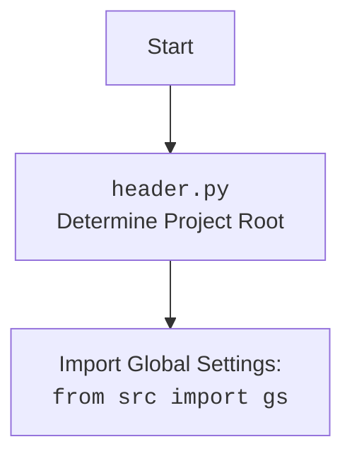

### **Analysis of Documentation and Example Code for Gemini API Integration**

This analysis covers the provided documentation and example code for a Python project integrating with the Google Gemini API.

#### **<algorithm>**

This section outlines the general workflow and concepts presented in the documentation. The core logic is encapsulated within the `GoogleGenerativeAI` class, which handles various interactions with the Google Gemini API.

1.  **Project Initialization**:
    *   The user clones the repository and installs the required dependencies using `pip install -r requirements.txt`.
    *   A configuration file (`config.json`) is created or modified to include the API key and model settings.
2.  **`GoogleGenerativeAI` Class Instantiation**:
    *   The `GoogleGenerativeAI` class is imported along with global settings (`gs`).
    *   An instance of `GoogleGenerativeAI` is created using the API key from global settings and an optional system instruction.
        *   Example: `ai = GoogleGenerativeAI(api_key=gs.credentials.gemini.api_key, system_instruction="...")`.
3.  **API Interaction Methods**:
    *   **`ask(q: str, attempts: int = 15) -> Optional[str]`**: Sends a text query `q` to the model, retrying up to `attempts` times. Returns the model's response or `None` on failure.
    *   **`chat(q: str, chat_data_folder: Optional[str | Path], flag: str = "save_chat") -> Optional[str]`**: Sends a message `q` to a chat session, managing chat history based on the `flag` ("save_chat", "read_and_clear", "clear", or "start_new"). Returns the model's response or `None` on failure.
    *   **`describe_image(image: Path | bytes, mime_type: Optional[str] = 'image/jpeg', prompt: Optional[str] = '') -> Optional[str]`**: Sends an image to the Gemini Pro Vision model for a description using the provided `prompt`. Returns the description or `None` on failure.
    *   **`upload_file(file: str | Path | IOBase, file_name: Optional[str] = None) -> bool`**: Uploads a file to the Gemini API, using the name `file_name`
4.  **Example Usage in `main()` Function**:
    *   **Image Description**: The code loads an image (`test.jpg`) and attempts to describe it, first with a JSON formatting prompt and then with a simple object-listing prompt. The results are printed.
    *   **File Upload**: The code creates a text file (`test.txt`), uploads it to the Gemini API, and prints the upload response.
    *   **Chat Session**: A loop is initiated, which takes user input, sends it to the chat API and prints the response until user enters `exit`.
5.  **Logging and History**:
    *   All errors are logged in files in the `external_storage/gemini_data` directory.
    *   Chat histories are saved to JSON and TXT files in the `external_storage/gemini_data/history/` directory.
6.  **Error Handling**: The code includes mechanisms to retry requests in case of network issues, authentication errors, and quota limits.
7.  **License and Author**: The project is released under the MIT license by the author `hypo69`.

#### **<mermaid>**

```mermaid
flowchart TD
    Start --> SetupProject[Setup project (clone, install dependencies, configure config.json)]
    SetupProject --> InstantiateGoogleGenerativeAI[Instantiate GoogleGenerativeAI class]
    InstantiateGoogleGenerativeAI --> CallAskMethod[Call ask method to send a text prompt]
    InstantiateGoogleGenerativeAI --> CallChatMethod[Call chat method to manage a chat session]
    InstantiateGoogleGenerativeAI --> CallDescribeImageMethod[Call describe_image method for image description]
    InstantiateGoogleGenerativeAI --> CallUploadFileMethod[Call upload_file method for file upload]
    CallAskMethod --> LogAndReturn[Log action and return result]
    CallChatMethod --> LogAndReturn
     CallDescribeImageMethod --> LogAndReturn
     CallUploadFileMethod --> LogAndReturn
    LogAndReturn --> SaveHistory[Save chat history in JSON and TXT]
    SaveHistory --> ManageErrors[Manage request errors (retry, log)]
    ManageErrors --> End
```



**Analysis of dependencies**:

*   `google-generativeai`: The official Google library for interacting with Gemini models. This is the core dependency for the project.
*   `requests`: A library for making HTTP requests. The `requests` is used to handle request exceptions.
*   `grpcio`: A library for gRPC, used for communication with the Gemini API.
*  `google-api-core`: A library that contains the core Google client apis, and is a dependency for the google-generativeai.
*   `google-auth`: A library for authentication with Google APIs, required by `google-generativeai`.
*   Custom project dependencies: The code also depends on project specific configurations via `gs` and modules within `src` package.

#### **<explanation>**

*   **Imports**:
    *   The documentation highlights the following external dependencies: `google-generativeai`, `requests`, `grpcio`, `google-api-core`, and `google-auth`. These are required for the project to interact with the Google Gemini API.
    *   The example code uses imports such as `asyncio`, and `pathlib.Path`, to perform asynchronous operations and use file paths.
    *   The example code uses `from src.ai.gemini import GoogleGenerativeAI`, and `import src.gs` which makes it depend on internal modules of the project.
*   **Classes**:
    *   `GoogleGenerativeAI`: This is the main class in the project.
        *   **Role**: Encapsulates all functionality needed for interacting with Google Gemini models, including sending text prompts, maintaining chat history, describing images, and uploading files.
        *   **Attributes**:
             *  `api_key`
             * `model_name`
             * `generation_config`
             * `system_instruction`
             * `dialogue_log_path`
             * `dialogue_txt_path`
             * `history_dir`
             * `history_txt_file`
             * `history_json_file`
             * `chat_history`
             * `model`
             * `_chat`
        *   **Methods**:
            *   `__init__`: Initializes the `GoogleGenerativeAI` object with an API key, the name of the model, generation settings and optional system instructions.
            *   `ask`: Sends a text prompt to the Gemini model.
            *    `chat`: Sends a message in the chat session.
            *  `describe_image`: Sends an image to the Gemini Vision model for a textual description.
            *   `upload_file`: Uploads a file using the Gemini API.
*   **Functions**:
    *   The documentation mentions a `main()` function within the example code which is used for demonstration purposes.
        *   **Arguments**: None.
        *   **Return value**: None.
        *   **Purpose**: Provides a basic usage example of the `GoogleGenerativeAI` class, covering the basic operations of image description, file upload, and chat interaction.
        *   **Example**: The `main` function creates an instance of `GoogleGenerativeAI`, describes an image using both JSON and normal prompt, uploads a text file, and provides a chat interface.
*   **Variables**:
    *   The example code shows the use of global settings variable `gs` to get the API key.
    *   Several variables are created and used within `main`, and they all have a clear purpose and are used appropriately.
*   **Potential Errors/Improvements**:
    *   **Configuration**: The documentation instructs the user to create a `config.json` file, but it does not explain if other configuration formats are supported, if the file can be in a different location, and how to configure this.
    *   **Error Handling**: While the code mentions error handling, it lacks a detailed explanation of how specific errors are handled or how logging is performed.
    *   **Code Example**: The example includes file operations (`test.txt`, `test.jpg`) that may require more user guidance. It is advisable to provide more context or a default implementation to help the user execute the provided examples.
    *   **Documentation**: The project could benefit from more detailed comments for class methods and example code, and from explanations of error types, retry mechanisms, and log files.
    *   **Modularity**: The documentation doesn't discuss how the project would be extended if new functionality is needed (e.g. adding support for video processing or other types of data).
    *  **Hardcoded paths**: The documentation mentions the  `external_storage/gemini_data` directory, but does not mention how this can be configured. The same applies to the `config.json` file.
*   **Chain of Relationships**:
    *   The `GoogleGenerativeAI` class is the main entry point for interacting with the Gemini API, and it relies on the `google-generativeai` library.
    *  The class uses configuration parameters defined using global settings, therefore it depends on the global settings module.
    *   The `main()` function demonstrates how to use the methods of the `GoogleGenerativeAI` class, and provides an end to end example of all implemented methods.
    *   Logging functionality is implicitly tied to the file operations for saving chat history, and error handling.
    *   The correct functioning of the described project, depends on the configuration file, and the api key, that need to be correctly setup.
    *  The `GoogleGenerativeAI` class makes use of custom modules for file operations, image processing, and logging establishing internal project dependencies.

    In summary, the documentation and code outline a project designed for interacting with Google Gemini models by providing an high-level interface which is the `GoogleGenerativeAI` class. The provided functionality supports different operations, like text prompts, chat interaction, image description and file uploads. The project is intended to be configured using the `config.json` file, and handles errors using a retry mechanism and logging.