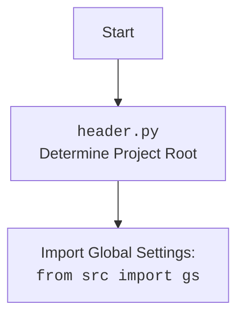

### **Analysis of `src/ai/gemini/__init__.py`**

#### **<algorithm>**

1.  **Start**: The script begins execution.
2.  **Import `GoogleGenerativeAI`**: Imports the `GoogleGenerativeAI` class from the `generative_ai.py` module within the same directory.
    *   Example: `from .generative_ai import GoogleGenerativeAI` imports the class.
3.  **End**: The script finishes execution.

#### **<mermaid>**

```mermaid
flowchart TD
    Start --> ImportGoogleGenerativeAI[Import <code>GoogleGenerativeAI</code> from <code>.generative_ai</code> (<code>generative_ai.py</code>)]
    ImportGoogleGenerativeAI --> End
```



**Analysis of dependencies**:

*   `generative_ai.py`: This module is imported to access the `GoogleGenerativeAI` class, which is the core class for interacting with the Gemini AI models. This indicates that the `__init__.py` file is making this core class available when the `src.ai.gemini` package is imported.

#### **<explanation>**

*   **Imports**:
    *   `GoogleGenerativeAI` from `.generative_ai`: Imports the `GoogleGenerativeAI` class from the `generative_ai.py` module located in the same directory. The dot (`.`) denotes a relative import, which means it imports from a module within the same package.
        *   **Relationship**: This import establishes a dependency on `generative_ai.py`, which implements the functionality for interacting with the Google Gemini AI API.
*   **Classes**: None.
*   **Functions**: None.
*   **Variables**: None.
*   **Potential Errors/Improvements**:
    *   **Implicit Dependency**: This `__init__.py` file creates an implicit dependency on the `generative_ai.py` module. If the `generative_ai.py` module is missing or has errors, this import will fail.
    *   **Limited Functionality**: The `__init__.py` file currently only imports the `GoogleGenerativeAI` class. If the package was to contain more classes or functions, it would be useful to import them here, so that they are directly available when importing this package.
    *  **Documentation**: The module documentation is minimal and could be expanded to explain the role of the imported `GoogleGenerativeAI` class within the package.
*   **Chain of Relationships**:
    *   This `__init__.py` file is part of the `src.ai.gemini` package, which is intended to manage interactions with the Google Gemini AI API.
    *   It directly depends on `generative_ai.py`, which contains the core logic for making API calls and handling responses.
    *   Any module importing the `src.ai.gemini` package will gain access to the `GoogleGenerativeAI` class, which is the primary interface for using the Gemini API.
    *   The `generative_ai.py` module depends on the `src/ai/gemini/header.py` and also on settings from `src/gs.py`, therefore, this `__init__.py` has an indirect dependency on these modules, which should be setup prior to loading this package.

    In summary, the `__init__.py` file within `src/ai/gemini` exposes the `GoogleGenerativeAI` class, making it easily accessible for use in other parts of the project. This establishes a clear chain of dependencies where `generative_ai.py` is the backend implementation for the Gemini API usage.