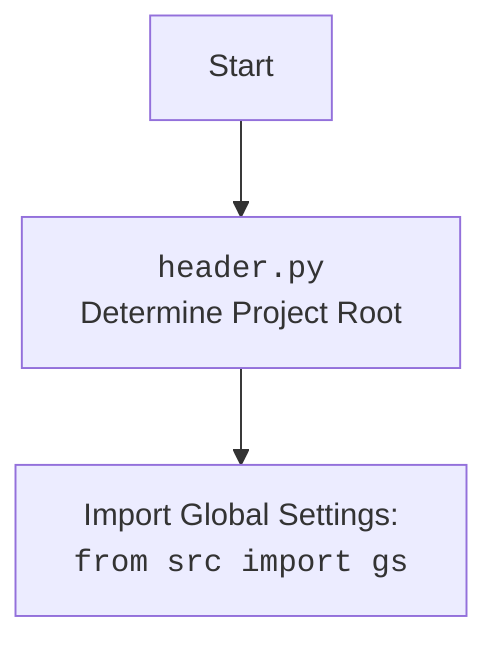

### **Analysis of `src/ai/gemini/generative_ai.py`**

#### **<algorithm>**

1.  **Start**: The script begins execution.
2.  **Import Modules**:
    *   Standard libraries: `codecs`, `re`, `asyncio`, `time`, `json`, `io.IOBase`, `pathlib.Path`, `typing`, `dataclasses`, `base64`.
    *   External libraries: `google.generativeai` (as `genai`), `requests`.
    *   `grpc` related exceptions: `RpcError` and various exceptions from `google.api_core.exceptions` and `google.auth.exceptions`.
    *   Custom modules: `header`, `src.logger.logger`, `src.gs`, `src.utils.file`, `src.utils.date_time`, `src.utils.jjson`, `src.utils.image`, `src.utils.printer`.
3.  **Initialize `TimeoutCheck`**: Creates an instance of the `TimeoutCheck` class.
4.  **`normalize_text` Function**:
    *   **Input**: `text` (string).
    *   **Process**: Replaces `\
` with `
` in the input string.
    *   **Output**: Returns the modified `text` (string).
5.  **`remove_html_blocks` Function**:
    *   **Input**: `text` (string).
    *   **Process**: Removes all text blocks enclosed in `\`\`\`html` and `\`\`\`` or `\`\`\`
` using regular expressions.
    *   **Output**: Returns the modified `text` (string).
6.  **`GoogleGenerativeAI` Class**:
    *   **Attributes**:
        *   `api_key` (str): API key for Google Gemini.
        *   `model_name` (str): Name of the model, defaults to `"gemini-2.0-flash-exp"`.
        *   `generation_config` (Dict): Configuration settings for generation, default to `{"response_mime_type": "text/plain"}`.
        *   `system_instruction` (Optional[str]): Optional system instruction for the model.
        *   `dialogue_log_path` (Path): Path to the directory for dialogue logs (initialized in `__post_init__`).
        *   `dialogue_txt_path` (Path): Path to the text file for dialogue logs (initialized in `__post_init__`).
        *   `history_dir` (Path): Path to the directory for chat history files (initialized in `__post_init__`).
        *   `history_txt_file` (Path): Path to the text file for chat history (initialized in `__post_init__`).
        *   `history_json_file` (Path): Path to the JSON file for chat history (initialized in `__post_init__`).
        *   `chat_history` (List[Dict]): List to store the chat history (initialized as empty list).
        *   `model` (Any): Instance of `genai.GenerativeModel` (initialized in `__post_init__`).
        *   `_chat` (Any): Instance of the chat session, from method `start_chat` (initialized in `__post_init__`).
        *  `MODELS` (List[str]): List of available Gemini models, initialized as `["gemini-1.5-flash-8b","gemini-2-13b","gemini-3-20b","gemini-2.0-flash-exp"]`

    *   **`__post_init__` Method**:
        *   Initializes the `dialogue_log_path`, `dialogue_txt_path`, `history_dir`, `history_txt_file`, and `history_json_file` based on the project root and global settings.
        *   Configures `genai` using the provided `api_key`.
        *   Initializes the `genai.GenerativeModel` object, for access to the Gemini API, and the chat session using the `_start_chat` method.
    *   **`_start_chat` Method**:
        *   Starts a chat session using `self.model.start_chat` by using system instructions if available, or starts a new session with empty history.
        *   **Output**: Returns the created chat session.
    *   **`clear_history` Method**:
        *   Clears the chat history in memory (`self.chat_history`).
        *   Removes the chat history JSON file.
        *   Logs the action using the logger module.
    *   **`_save_chat_history` Method**:
        *   **Input**:  `chat_data_folder` (Optional[str | Path]).
        *   Saves the `chat_history` to a JSON file (`self.history_json_file`).
    *   **`_load_chat_history` Method**:
        *   **Input**: `chat_data_folder` (Optional[str | Path]).
        *   Loads the chat history from a JSON file (`self.history_json_file`).
        *   Initializes the `_chat` with loaded history if available.
    *   **`chat` Method**:
        *   **Input**: `q` (str) - user question, `chat_data_folder` (Optional[str | Path]) - folder path for saving the chat data and `flag` (str) -  which defines how the chat history is handled.
        *   Manages the chat history: loads, clears, or starts a new session based on the input flag.
        *   Sends the user's query to the Gemini model and returns response string.
        *   Appends the user's query and model's response to the `chat_history`.
        *   Saves the chat history to a JSON file using the `_save_chat_history` method.
    *   **`ask` Method**:
        *   **Input**: `q` (str) - user question and `attempts` (int) - max attempts to get a result from the Gemini model.
        *   Sends a text query to the Gemini model, handles potential errors (network, service, authentication, quota, input and other errors) with retry logic using an exponential backoff and logging.
        *   **Output**: Returns the response from the model as `str`, or `None` in case of errors.
        *   Saves the user question and model response to the dialogue log using `_save_dialogue` method.
    *   **`describe_image` Method**:
        *   **Input**: `image` (Path | bytes) - Path or byte representation of the image, `mime_type` (Optional[str]) - file mime type and `prompt` (Optional[str]) - prompt.
        *   Sends an image to the Gemini Pro Vision model along with a text prompt and returns the textual description.
    *    **`upload_file` Method**:
         *  **Input**: `file` (str | Path | IOBase) - File to be uploaded, `file_name` (Optional[str]) - Name of file to use.
         *  Uploads a file to the Gemini model's service.
    * **`_save_dialogue` method**:
         *  **Input**: `messages` (list[dict]), it is not used in the code, but is present.
         * Writes the dialogue into the dialog log file.
7. **`main` Function**:
    *   Creates an instance of `GoogleGenerativeAI`.
    *   Demonstrates how to use the `describe_image`, `upload_file` and `chat` methods of the `GoogleGenerativeAI` class.
    *   Includes an interactive chat loop for testing the conversational capabilities.
8.  **Execution**: If the script is run as the main program, it calls `asyncio.run(main())`.

#### **<mermaid>**

```mermaid
flowchart TD
    Start --> ImportModules[Import necessary modules]
    ImportModules --> InitTimeoutCheck[Initialize <code>TimeoutCheck</code>]
    InitTimeoutCheck --> DefineNormalizeText[Define <code>normalize_text</code> function]
    DefineNormalizeText --> DefineRemoveHtmlBlocks[Define <code>remove_html_blocks</code> function]
    DefineRemoveHtmlBlocks --> DefineGoogleGenerativeAI[Define <code>GoogleGenerativeAI</code> class]
    DefineGoogleGenerativeAI --> DefineMain[Define <code>main</code> function]
    DefineMain --> CheckMainExecution{<code>if __name__ == "__main__"</code>}
    CheckMainExecution -- Yes --> RunMain[<code>asyncio.run(main())</code>]
    RunMain --> End
     DefineGoogleGenerativeAI --> GoogleGenerativeAIInit[<code>GoogleGenerativeAI.__post_init__</code>]
    GoogleGenerativeAIInit --> GoogleGenerativeAIStartChat[<code>GoogleGenerativeAI._start_chat</code>]
    GoogleGenerativeAIStartChat --> GoogleGenerativeAIClearHistory[<code>GoogleGenerativeAI.clear_history</code>]
    GoogleGenerativeAIClearHistory --> GoogleGenerativeAISaveChatHistory[<code>GoogleGenerativeAI._save_chat_history</code>]
    GoogleGenerativeAISaveChatHistory --> GoogleGenerativeAILoadChatHistory[<code>GoogleGenerativeAI._load_chat_history</code>]
    GoogleGenerativeAILoadChatHistory --> GoogleGenerativeAIChat[<code>GoogleGenerativeAI.chat</code>]
        GoogleGenerativeAIChat --> GoogleGenerativeAIAsk[<code>GoogleGenerativeAI.ask</code>]
            GoogleGenerativeAIAsk --> GoogleGenerativeAIDescribeImage[<code>GoogleGenerativeAI.describe_image</code>]
                 GoogleGenerativeAIDescribeImage --> GoogleGenerativeAIUploadFile[<code>GoogleGenerativeAI.upload_file</code>]
```



**Analysis of dependencies**:

*   Standard libraries: These are built-in modules for various functionalities, including string manipulation (`re`, `codecs`), asynchronous programming (`asyncio`), time management (`time`), JSON handling (`json`), file handling (`pathlib`, `io`), data typing (`typing`), and data classes (`dataclasses`).
*   External libraries:
    *   `google.generativeai`: The official Google library for interacting with Gemini models, offering functionalities for text and multimodal generation and managing the Gemini API.
    *   `requests`: Used for handling HTTP requests and errors.
*   `grpc` and google api exceptions: Handles errors and exceptions related to the grpc framework and google apis.
*   Custom modules:
    *   `header`: Used to set up the project root and access global configurations.
    *   `src.logger.logger`: Custom logging module to handle logs throughout the project, centralizing how logs are recorded.
    *    `src.gs`: Used to get global settings parameters for authentication and file path settings.
    *   `src.utils.file`: Provides utilities for reading and saving files, and is used for reading configuration files or text files.
    *   `src.utils.date_time`: Provides date/time related utilities, like for instance a timeout check.
    *   `src.utils.jjson`: Custom functions for loading and saving JSON files.
    *   `src.utils.image`: Provides functionalities for image handling.
    *    `src.utils.printer`: Custom printer function to handle formatted printing.

#### **<explanation>**

*   **Imports**:
    *   Standard libraries: Provide basic functionalities such as file operations, regular expressions, and asynchronous programming.
    *   External libraries:
        *   `google.generativeai` (as `genai`): This library allows to interact with Google Gemini models for tasks such as text and image generation.
        *   `requests`: Used for making HTTP requests to APIs, and is used to make the request to the google API.
    *   `grpc` related libraries:
        *   These libraries provide error handling for network and API related issues.
    *   Custom modules:
        *   `header`: Used to access global variables such as project root.
            *   **Relationship**: Sets up project environment for usage of custom modules.
        *   `src.logger.logger`: Used for logging errors, information, and debugging messages throughout the application.
            *   **Relationship**: Centralized way to manage and track the project logs.
        *   `src.gs`: Used to access global settings defined in the project configurations.
            *   **Relationship**: Used to access API keys and paths to folders.
        *   `src.utils.file`: Used for reading and saving files to disk, providing a high-level abstraction over file operations.
            *   **Relationship**: Used for handling files like chat history and log files.
        *   `src.utils.date_time`: Used for managing date and time related operations.
            *   **Relationship**: Used to manage timeouts in the Gemini API calls.
        *   `src.utils.jjson`: Used for loading and saving data in the JSON format, including chat history and configuration files.
            *   **Relationship**: Provides enhanced features like namespace support.
        *    `src.utils.image`: Used to read image files as bytes, to process them with the Gemini API.
            *    **Relationship**: Used when processing image files with the Gemini API.
        *   `src.utils.printer`: Custom printer method that provides formatted printing to improve readability.
             *  **Relationship**:  Used for pretty printing results or messages in the terminal.
*   **Classes**:
    *   `GoogleGenerativeAI`: This class encapsulates the functionality for interacting with Google's Gemini models.
        *   **Attributes**: Holds configurations for the model, API keys, system instructions, paths for saving logs and histories, history for chat sessions, and the `model` instance.
        *   **Methods**: Provides methods for initializing the model (`__post_init__`), starting a chat session (`_start_chat`), clearing history (`clear_history`), saving/loading chat history (`_save_chat_history`, `_load_chat_history`), sending messages in a chat session (`chat`), making an API request (`ask`), describing images (`describe_image`), uploading files (`upload_file`).
*   **Functions**:
    *   `normalize_text(text: str) -> str`: Replaces escape sequences in a string.
        *   **Arguments**: `text` (str): Input text to be normalized.
        *   **Return value**: Returns a string with replaced escape characters.
        *   **Purpose**: Prepares text for output or processing, by normalizing the escaped characters and special symbols.
        *   **Example**: `normalize_text("Hello\
World")` returns `"Hello
World"`.
    *   `remove_html_blocks(text: str) -> str`: Removes HTML code blocks from the text.
        *   **Arguments**: `text` (str): Input text from which to remove html code blocks.
        *   **Return value**: Returns a string with removed HTML blocks.
        *   **Purpose**: Cleans text from html code blocks.
        *   **Example**: `remove_html_blocks("Hello World")` returns `"Hello World"`.
*   **Variables**:
    *   `timeout_check`: Instance of the class `TimeoutCheck` from the `src.utils.date_time` package. Used to perform the check of a request timeout.
        *   **Usage**:  Allows to check the elapsed time in a request or a task.
    *   `__root__`: The global variable `__root__` from `header` module is used to define absolute project path for creating other file paths.
        *   **Usage**: Allows access to the project root to define other paths for files and folders.
    *   `gs`: The global settings variable is imported from the `src` package, and used to access configuration settings.
        *   **Usage**:  Accesses parameters like API keys and paths defined in the configuration file.
*   **Potential Errors/Improvements**:
    *   **Error Handling**: The code includes try-except blocks for most operations, but could still be improved. Error messages could be more descriptive and user-friendly. It should also log more detailed information, which is useful for debugging.
    *   **Magic Strings**: String literals such as `"save_chat"`, `"read_and_clear"`, `"clear"` and `"start_new"` could be defined as constants to avoid typos.
    *   **Modularity**: The `_save_dialogue` method is present, but not implemented, it should be removed if not used, or implemented to improve the module functionality.
    *   **Logging**: Some logs could include more context, such as the specific API endpoint or input data for better error tracking.
    *   **Asynchronous Handling**: Several methods (e.g. `ask`, `describe_image`, `upload_file`) are asynchronous, but could be implemented with better exception handling (e.g. use asyncio.gather to manage multiple concurrent API requests).
    *   **Code Duplication**:  The code for error handling and logging is repetitive (e.g. in the ask method), and it should be improved using a common function.
    *   **File Upload**:  The `upload_file` method deletes the file and uploads again, in case of error, which seems unnecessary, and could be improved.
    *   **Unused parameters**: The `messages` parameter of `_save_dialogue` is not used, and should be removed.
*   **Chain of Relationships**:
    *   The `generative_ai.py` module is responsible for handling the Google Gemini API calls. It relies on the project settings and configurations.
    *    `generative_ai.py` depends on the `header` to determine the root path of the project, and `src.gs` to load configurations.
    *   `generative_ai.py` depends on `src.logger.logger` to track operations and errors.
    *   `generative_ai.py` utilizes utilities from `src.utils.file`, `src.utils.date_time`, `src.utils.jjson`, `src.utils.image`, `src.utils.printer`, for file, date/time, JSON handling, image processing, and printing functionalities.
    *   `generative_ai.py` calls the Google Gemini API using `google.generativeai` and `requests`, establishing its dependency on these libraries.
    *   This module is used in the `src.ai` package which manages the AI functionalities of the project.

    In summary, `generative_ai.py` is a core module for handling Google Gemini API interactions. It relies on various custom and external libraries, and is central to the AI functionality of the project. The class provides methods for various tasks, such as text generation, chat, image description and file uploading, including error handling, and logging features, that allows the project to manage interactions with Gemini models in a robust way.