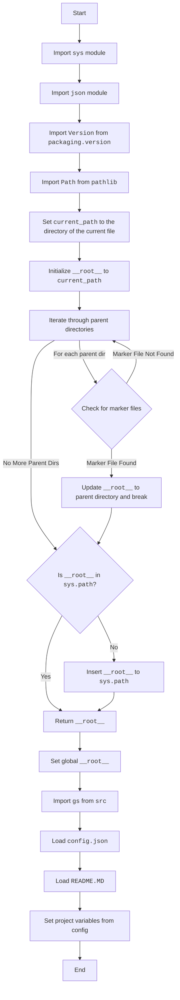
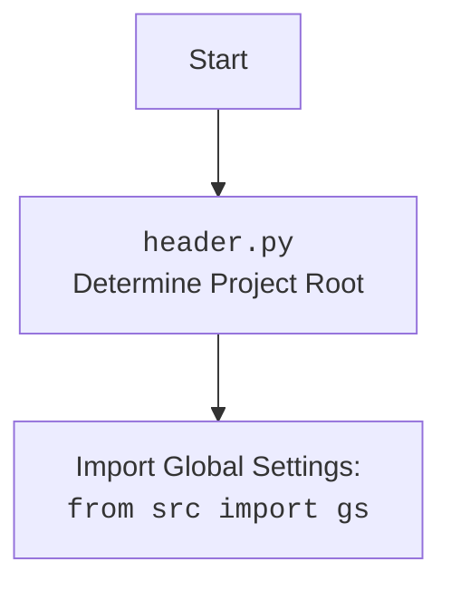

### **Analysis of `src/ai/gemini/header.py`**

#### **<algorithm>**

1.  **Start**: The script begins execution.
2.  **Import Modules**:
    *   `sys`: Standard module for system-specific parameters and functions.
    *   `json`: Standard module for working with JSON data.
    *   `Version` from `packaging.version`: Used for handling and comparing versions.
    *   `Path` from `pathlib`: Standard module for manipulating file paths.
3.  **`set_project_root` Function**:
    *   **Initialization**:
        *   `current_path` is set to the directory containing the current file (`header.py`). The path is resolved to absolute path.
            *Example: If `header.py` is in `/home/user/project/src/ai/gemini`, `current_path` becomes `/home/user/project/src/ai/gemini`.*
        *   `__root__` is initialized to `current_path`, assuming the current directory is initially the root.
            *Example: `__root__` is initialized to `/home/user/project/src/ai/gemini`.*
    *   **Iterate Through Parent Directories**:
        *   The code iterates through the current directory (`current_path`) and all of its parent directories.
            *Example: it iterates through `/home/user/project/src/ai/gemini`, `/home/user/project/src/ai`, `/home/user/project/src`, `/home/user/project`, `/home/user`, and `/home`.*
        *   **Check for Marker Files**: For each directory, it checks if any of the `marker_files` (`'__root__'`, `'.git'`) exist in it.
            *Example: it checks for the presence of `__root__` or `.git` in each of the directories.*
        *   **Update `__root__`**: If a marker file is found in a directory, the path of that directory is assigned to the `__root__` and breaks the loop.
            *Example: if `.git` is found in `/home/user/project`, `__root__` will be updated to `/home/user/project` and the loop will break.*
    *   **Update `sys.path`**: If the found `__root__` directory is not in the system's path, it adds the `__root__` to the beginning of the system's path.
        *Example: if `/home/user/project` is not present in `sys.path`, it will be prepended to `sys.path`.*
    *   **Return Root Path**: Returns the `__root__` directory.
        *Example: the function returns `/home/user/project`.*
4.  **Set Global `__root__`**:
    *   The `set_project_root()` function is called and the returned value is assigned to global variable `__root__`.
        *Example: `__root__: Path = set_project_root()` will assign `/home/user/project` to the global variable `__root__`.*
5.  **Import Global Settings**: Imports the `gs` variable from the `src` module.
    *   Example: `from src import gs` imports global settings variable.
6.  **Load Configuration**:
    *   Attempts to load the `config.json` file from the `src` directory.
        *Example: If `gs.path.root` is `/home/user/project`, it will try to open `/home/user/project/src/config.json`.*
    *   If successful, the JSON data is loaded into the `config` variable. If the file does not exist or is invalid JSON, the `config` variable will be assigned `None`.
7.  **Load Documentation**:
    *   Attempts to load `README.MD` file.
        *Example: If `gs.path.root` is `/home/user/project`, it will try to open `/home/user/project/src/README.MD`.*
    *   If the file exists the content will be assigned to the `doc_str` variable, if not the variable will be `None`.
8.  **Set Global Project Variables**:
    *   The code extracts various project details from the loaded configuration (`config`), and sets them to global variables. If `config` is `None`, it sets the default values.
        *   `__project_name__`: Project name (defaults to `"hypotez"`).
        *   `__version__`: Project version (defaults to `""`).
        *   `__doc__`: Project documentation string from `README.MD`, if present.
        *   `__details__`: Project details (initialized as `""`).
        *   `__author__`: Project author (defaults to `""`).
        *    `__copyright__`: Project copyright (defaults to `""`).
        *    `__cofee__`: Message with a link for buying coffee to the developer. (defaults to `Treat the developer to a cup of coffee for boosting enthusiasm in development: https://boosty.to/hypo69`).
9. **End**: The script finishes execution.

#### **<mermaid>**

**Analysis of dependencies**:

*   `sys`: The `sys` module is a built-in Python module used to access system-specific parameters and functions. Here, it is used to access and modify the `sys.path` which is used by the Python interpreter to locate modules to import.
*   `json`: The `json` module is a built-in Python module that provides methods for encoding and decoding JSON data. It is used here for loading project configuration from a JSON file.
*   `packaging.version`: This module is an external library and is used to handle versions.
*   `pathlib`: The `pathlib` module is a built-in Python module used for working with file paths in an object oriented way, and here it is used to create and handle file paths.
*   `src`: This refers to the `src` package within the project, from which the `gs` global settings variable is imported.

#### **<explanation>**

*   **Imports**:
    *   `sys`: Provides access to system-specific parameters and functions.
        *   **Relationship**: Used to modify the system's module search path.
    *   `json`: Provides functionalities for working with JSON data.
        *   **Relationship**: Used for loading project configuration from `config.json`.
    *  `Version` from `packaging.version`: Used to handle project versioning.
         *  **Relationship**: Used to compare different versions of the application.
    *   `Path` from `pathlib`: Provides object-oriented way for file paths.
        *   **Relationship**: Used to work with file paths.
    *   `gs` from `src`: Global settings variable.
         *   **Relationship**: Used to access the project configuration and paths.
*   **Classes**: None.
*   **Functions**:
    *   `set_project_root(marker_files: tuple = ('__root__', '.git')) -> Path`:
        *   **Arguments**:
            *   `marker_files` (tuple): A tuple of strings representing filenames or directory names to identify the project root. Defaults to `('__root__', '.git')`.
        *   **Return value**: Returns a `Path` object representing the project root directory.
        *   **Purpose**:  Finds the root directory of the project by searching upwards from the current file's directory. The search stops at the first directory containing any of the specified marker files. It also adds the project's root directory to the Python search path if it is not already present.
        *   **Example**: If the file is located in `/home/user/project/src/ai/gemini/header.py` and a `.git` directory is located in `/home/user/project`, the function returns a Path object representing `/home/user/project`.
*   **Variables**:
    *   `__root__`: A global variable (of type `Path`). Represents the project root directory.
        *   **Usage**: Stores the calculated project root, which is then added to the `sys.path`.
    *   `current_path`: A variable of type `Path`. Represents the path to the directory containing the current file (`header.py`).
        *   **Usage**: Used as starting point when traversing parent directories.
    * `parent`: A variable of type `Path`. Represents the parent directories of the current directory in the loop.
        *   **Usage**: Used to check for presence of marker files.
    * `marker`: A variable of type `str`. Represent the name of file to check for in the parent directories
        *  **Usage**: Used in loop to perform marker check on `parent`.
    *   `gs`:  The global settings variable is imported from the `src` package.
        *    **Usage**: Used to access configuration settings such as paths.
    *   `config`: A dictionary object that stores the loaded configuration from `config.json`.
        *   **Usage**:  Stores the project configuration parameters.
    *   `doc_str`: A string object that stores the content loaded from `README.MD` file.
         *    **Usage**: Used to store the project documentation string.
    *   `__project_name__`:  A string object that contains the project name, obtained from `config` or default value.
          *   **Usage**: Project name.
    *   `__version__`: A string object that contains the project version, obtained from `config` or default value.
          *   **Usage**: Project version.
    *   `__doc__`:  A string object that contains project documentation obtained from `README.MD` or default empty string.
          *   **Usage**: Project documentation.
    *   `__details__`: A string object that contains project details, is initialized with default empty string `''`
          *   **Usage**: Project details.
    *   `__author__`: A string object that contains the project author, obtained from `config` or default value.
          *   **Usage**: Project author.
    *   `__copyright__`: A string object that contains the project copyright, obtained from `config` or default value.
          *   **Usage**: Project copyright.
    *   `__cofee__`: A string object that contains a message with a link to buy coffee for the developer, obtained from settings or a default string.
          *   **Usage**: Link for buying coffee to the developer.
*   **Potential Errors/Improvements**:
    *   **Error Handling**: The code uses a basic try-except block for loading `config.json` and `README.MD`, but it could be improved with specific error logging using the custom `logger` module.
    *   **Global Variable**: The global variable `__root__` may cause issues in complex applications. Consider using a different approach (e.g. a class or a context variable) for setting the project root.
    *   **Code Duplication**: The `set_project_root` function is similar to the same function in `/src/header.py`. The implementation of this function should be unified in one place.
    *   **Hardcoded paths**: The paths to `config.json` and `README.MD` are hardcoded, and it should be configurable via project settings.
    *   **Documentation**: The module documentation lacks a detailed explanation of the purpose of the global variables, and should be improved. It should include a comment for the global variable:  `"""__root__ (Path): Path to the root directory of the project"""`.
    *   **Settings**: The `settings` variable is used but is not defined, therefore, the code using it will throw an error.
*   **Chain of Relationships**:
    *  This module has the same purpose as `/src/header.py`, but it is within `/src/ai/gemini` package, which suggests that it is used to provide settings specific for the gemini ai module.
    *   The `src/ai/gemini/header.py` module sets up the project root. This root is the base from which other modules are located within the `src/ai/gemini` directory and its subdirectories.
    *   Other modules in the `src/ai/gemini` package rely on the project root being set up correctly by the `src/ai/gemini/header.py` module for proper module imports.
    *   The global variable `__root__` makes the root accessible to other modules in the `src/ai/gemini` package.
    *   The configuration (`config`) loaded from `config.json` may be used by other modules within `src/ai/gemini` to adjust the functionality.
    *   The `src/ai/gemini/header.py` also depends on `gs` to load the project root, which is an implicit dependency of `src/header.py`.

    In summary, `src/ai/gemini/header.py` is a critical module for setting up the project environment specific for the gemini module. It correctly identifies the project root, ensures that other modules can import packages using relative paths and provides basic project parameters, using the global configuration, loaded from `config.json`. The module provides similar functionalities as the `src/header.py`.