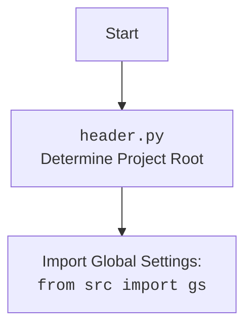

### **Analysis of `src/gs.py` (Revisited)**

This is a re-analysis of the `src/gs.py` file.

#### **<algorithm>**

1.  **Start**: The script begins execution.
2.  **Import Modules**: The script imports necessary modules:
    *   `header`: Custom module, likely containing project-level configurations or setup.
        *Example: `import header` initializes project root and global settings.*
    *   `j_loads_ns` from `src.utils.jjson`: Custom function for loading JSON data from a file, with namespace support.
        *Example: `from src.utils.jjson import j_loads_ns` prepares the function to read configurations.*
    *   `Path` from `pathlib`: Standard Python module for manipulating file paths.
        *Example: `from pathlib import Path` allows for easy file path handling.*
3.  **Load Configuration**: The script loads configuration data from `config.json` using `j_loads_ns`. The file path is created as an object by the `Path` module.
    *Example: `Path('config.json')` creates a Path object for the configuration file.*
    *Example: `gs = j_loads_ns(Path('config.json'))` loads config data into the `gs` variable.*
4.  **Set Global Variables**: The loaded configuration data is assigned to the global variable `gs`. This data is intended to be used throughout the application.
5.  **End**: The script finishes execution.

#### **<mermaid>**

```mermaid
flowchart TD
    Start --> ImportHeader[Import <code>header</code> module<br>Determine Project Root]
    ImportHeader --> ImportJJson[Import <code>j_loads_ns</code> from <code>src.utils.jjson</code>]
    ImportJJson --> ImportPathlib[Import <code>Path</code> from <code>pathlib</code>]
    ImportPathlib --> CreatePathObject[Create Path object<br><code>Path('config.json')</code>]
    CreatePathObject --> LoadConfig[Load JSON configuration<br><code>j_loads_ns(Path('config.json'))</code>]
    LoadConfig --> SetGlobalVariable[Set global variable<br><code>gs</code> = loaded JSON]
    SetGlobalVariable --> End
```



**Analysis of dependencies**:

*   `header`: A custom module used to initialize the project, likely establishing the project's root directory and perhaps setting up other global configurations or environment variables, that may be used by other modules.
*   `src.utils.jjson`: This module provides a custom function `j_loads_ns` for loading JSON files. This indicates that the project relies on a custom method to handle JSON files instead of standard `json.load`. This likely enhances features such as namespace support or custom error handling.
*   `pathlib`: This module is part of the standard Python library. It is used for handling file paths more intuitively and efficiently. It's used here to create a Path object representing the `config.json` file.

#### **<explanation>**

*   **Imports**:
    *   `header`: Imports a custom module, likely from the same project. It's used to set up the project's environment, determine the root directory, and possibly set global configurations. This suggests a modular design where initial project setup is encapsulated in a separate module.
    *   `j_loads_ns` from `src.utils.jjson`: Imports the custom function, responsible for reading and parsing JSON files. This function seems to enhance JSON handling by providing namespace support, allowing for more structured configurations.
        *   **Relationship**: `j_loads_ns` is part of the custom utility module within the project (`src.utils.jjson`). This shows internal dependency within the project for handling JSON files.
    *   `Path` from `pathlib`: A standard Python module used for creating and manipulating file paths. It provides a more convenient way to manage file paths across different operating systems.
        *   **Relationship**: `pathlib` is a part of the Python standard library and provides functionality for creating a `Path` object for the `config.json` file path.
*   **Variables**:
    *   `gs`: A global variable. The type is inferred by the return type of `j_loads_ns`, and it is a JSON object (dict), and used to store configuration parameters loaded from `config.json`. It is intended to be a global configuration.
        *   **Usage**: The `gs` variable is used to access configuration settings throughout the application.
*   **Functions**:
    *   `j_loads_ns`: This function is imported from `src.utils.jjson`. It reads JSON data from a file, provides namespace support and returns data as dictionary object.
        *   **Arguments**: It receives a `Path` object representing a path to a JSON file, as an argument.
        *   **Return value**: Returns the JSON data as a dictionary object or `None` in case of error.
        *   **Purpose**:  Loads JSON configuration data with namespace support.
        *   **Example**:  `gs = j_loads_ns(Path('config.json'))` loads the JSON content of config.json into the `gs` variable.
*   **Potential Errors/Improvements**:
    *   **Error Handling**: The code does not explicitly handle exceptions from `j_loads_ns`, which could potentially cause runtime errors if `config.json` does not exist or is not a valid JSON.  It is recommended to add error handling such as try/except blocks to capture exceptions and log them using the `logger` module from `src.logger.logger`.
    *   **Global Variable**: Usage of global variable `gs` may cause issues in complex applications due to its broad scope, making it difficult to track changes and debug errors. Consider using a more controlled way of accessing the configuration, such as using singleton or class objects.
    *   **Documentation**: Add documentation for the module using the defined style for comments and documentation.
    *   **Type Hinting**: The return type of the `j_loads_ns` function should be explicitly specified in the documentation (assuming that it returns a `dict`, or `None`).
*   **Chain of Relationships**:
    *   The `src/gs.py` script is the entry point for loading configuration data which may be used by other modules within the `src` package and its sub-packages.
    *   `src/gs.py` depends on the `header.py` module, which is responsible for project setup.
    *   `src/gs.py` depends on the `src.utils.jjson` module to handle JSON configurations. This establishes a dependency on the project's internal modules.
    *   The configuration data stored in `gs` will likely be used as input parameters or global settings for various classes, methods, and functions in other parts of the project, establishing a central configuration repository.

    In summary, `src/gs.py` is a crucial module responsible for loading and storing project configurations. It relies on custom modules for JSON handling, and setting project environment. The module forms an important part of the project, by loading and providing global settings used throughout the project.