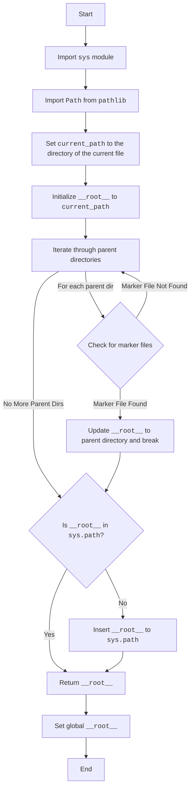

### **Analysis of `src/header.py`**

#### **<algorithm>**

1.  **Start**: The script begins execution.
2.  **Import Modules**:
    *   `sys`: Standard module for accessing system-specific parameters and functions.
        *Example: `import sys` is used for modifying the system's path.*
    *   `Path` from `pathlib`: Standard module for manipulating file paths.
        *Example: `from pathlib import Path` allows working with file paths as objects.*
3.  **`set_project_root` Function**:
    *   **Initialization**:
        *   `current_path` is set to the directory containing the current file (`header.py`). The path is resolved to absolute path.
            *Example: if `header.py` is in `/home/user/project/src`, `current_path` becomes `/home/user/project/src`.*
        *   `__root__` is initialized to `current_path`, assuming the current directory is initially the root.
            *Example: `__root__` is initialized to `/home/user/project/src`.*
    *   **Iterate Through Parent Directories**:
        *   The code iterates through the current directory (`current_path`) and all of its parent directories.
            *Example: it iterates through `/home/user/project/src`, `/home/user/project`, `/home/user`, and `/home`.*
        *   **Check for Marker Files**: For each directory, it checks if any of the `marker_files` (`'__root__'`, `'.git'`) exist in it.
            *Example: it checks for the presence of `__root__` or `.git` in each of the directories.*
        *   **Update `__root__`**: If a marker file is found in a directory, the path of that directory is assigned to the `__root__` and breaks the loop.
            *Example: if `.git` is found in `/home/user/project`, `__root__` will be updated to `/home/user/project` and the loop will break.*
    *   **Update `sys.path`**: If the found `__root__` directory is not in the system's path, it adds the `__root__` to the beginning of the system's path.
        *Example: if `/home/user/project` is not present in `sys.path`, it will be prepended to `sys.path`.*
    *   **Return Root Path**: Returns the `__root__` directory.
        *Example: the function returns `/home/user/project`.*
4.  **Set Global `__root__`**:
    *   The `set_project_root()` function is called and the returned value is assigned to global variable `__root__`.
        *Example: `__root__: Path = set_project_root()` will assign `/home/user/project` to the global variable `__root__`.*
5.  **End**: The script finishes execution.

#### **<mermaid>**

**Analysis of dependencies**:

*   `sys`: The `sys` module is a built-in Python module that provides access to system-specific parameters and functions. Here, it is used to access and modify the `sys.path` which is used by the Python interpreter to locate modules to import.
*   `pathlib`: The `pathlib` module is a built-in Python module that provides an object-oriented way to represent and manipulate file paths. It is used here to create and work with file path objects.

#### **<explanation>**

*   **Imports**:
    *   `sys`:  Provides access to system-specific parameters and functions, including `sys.path`, which is used to modify the Python module search path.
        *   **Relationship**: Used to add the project root to the Python search path so that other modules within the project can be imported correctly.
    *   `Path` from `pathlib`: Provides an object-oriented way to represent file paths, making path manipulation easier and more platform-independent.
        *   **Relationship**: Used to create `Path` objects to represent file paths, and provides convenient methods to navigate through parent directories and check for the existence of files.
*   **Classes**: None.
*   **Functions**:
    *   `set_project_root(marker_files: tuple = ('__root__', '.git')) -> Path`:
        *   **Arguments**:
            *   `marker_files` (tuple): A tuple of strings representing filenames or directory names used to identify the project root. Defaults to `('__root__', '.git')`.
        *   **Return value**: Returns a `Path` object representing the project root directory.
        *   **Purpose**:  Finds the root directory of the project by searching upwards from the current file's directory. The search stops at the first directory containing any of the specified marker files. It also adds the project's root directory to the Python search path if it is not already present.
        *   **Example**: If the file is located in `/home/user/project/src/header.py` and a `.git` directory is located in `/home/user/project`, the function returns a Path object representing `/home/user/project`.
*   **Variables**:
    *   `__root__`: A global variable (of type `Path`). Represents the project root directory. It's used as the base path for all other modules when importing local packages.
        *   **Usage**: Stores the calculated project root, which is then added to the `sys.path`, thus ensuring that the correct project modules are imported.
    *   `current_path`:  A variable of type `Path`. Represents the path to the directory containing the current file (`header.py`).
        *   **Usage**: Used as starting point when traversing parent directories.
    *  `parent`: A variable of type `Path`. Represents the parent directories of the current directory in the loop.
        *   **Usage**: Used to check for presence of marker files.
    * `marker`: A variable of type `str`. Represent the name of file to check for in the parent directories
        *  **Usage**: Used in loop to perform marker check on `parent`.
*   **Potential Errors/Improvements**:
    *   **Error Handling**: The code does not handle cases where the root directory cannot be found (i.e. none of the marker files exist). In such cases, it falls back to the directory where the script is located. It may be necessary to raise a more explicit exception or log an error in such scenarios.
    *   **Magic Strings**: The default `marker_files` tuple (`'__root__'`, `'.git'`) could be made configurable via a configuration file. This increases flexibility and improves maintainability.
    *   **Global Variable**: The global variable `__root__` may cause issues in complex applications. Consider using a different approach (e.g. a class or a context variable) for setting the project root.
    *   **Documentation**: The module documentation lacks a detailed explanation of the purpose of the global variable `__root__`. It should include a comment for the global variable:  `"""__root__ (Path): Path to the root directory of the project"""`.
*   **Chain of Relationships**:
    *   The `src/header.py` module sets up the project root. This root is the base from which other modules are located within the `src` directory and its subdirectories.
    *   Other modules in the `src` package rely on the project root being set up correctly by the `src/header.py` module for proper module imports. The global variable `__root__` makes the root accessible to other modules.
    *   The `src/gs.py` module, for example, relies on `header.py` to correctly set the project root and use it for loading `config.json`.
    *  If the `__root__` is updated in `header.py` any modules that import this will reflect the updated path.

    In summary, `src/header.py` is a critical module for setting up the project environment. It correctly identifies the project root, ensuring that other modules can import packages using relative paths.