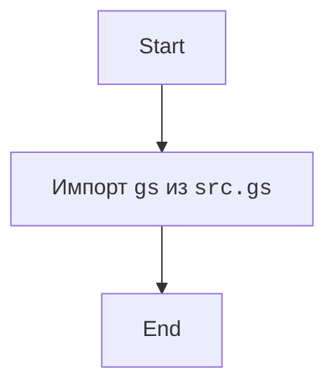
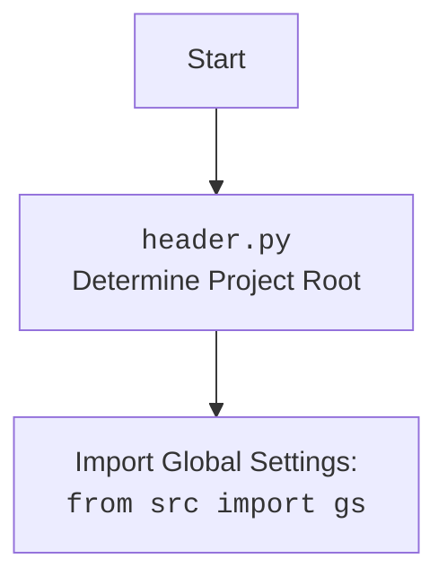

## <алгоритм>

1.  **Импорт `gs`**:
    *   Импортируется переменная `gs` из модуля `src.gs`.

## <mermaid>

## <объяснение>

### Импорты

*   **`from .gs import gs`**: Этот импорт предназначен для импорта переменной `gs` из модуля `gs.py`, который находится в той же директории, что и файл `__init__.py`. `gs` предположительно содержит глобальные настройки проекта.

### Переменные

*   **`gs`**: Эта переменная импортируется из модуля `src.gs`. Она предположительно содержит конфигурационные настройки, загруженные из файла `config.json` и является глобальной переменной для всего проекта.

### Потенциальные ошибки и области для улучшения

*   **Отсутствие явного указания пути**:  Импорт `from .gs import gs` подразумевает, что модуль `gs.py` находится в той же директории, что и текущий файл. Хотя это общепринятая практика для `__init__.py`, лучше делать импорт через явный путь, например `from src.gs import gs` .
*   **Отсутствие комментариев**:  Код очень простой, но было бы полезно добавить docstring для модуля и комментарий к импорту, объясняющий его назначение.

### Взаимосвязи с другими частями проекта

*   Этот файл (`__init__.py`) создает пакет `gemini_simplechat` и делает переменную `gs` доступной для импорта в другие модули этого пакета. Это позволяет различным частям проекта получать доступ к глобальным настройкам.
*   Модуль `gs.py` загружает глобальные настройки, и этот `__init__.py` делает их доступными для остального проекта.

### Вывод

Этот файл `__init__.py` является точкой входа для пакета `gemini_simplechat`. Он импортирует переменную `gs` из `src.gs`, делая её доступной для использования в других модулях пакета. Код простой, но является важным компонентом для создания пакета и доступа к общим настройкам проекта.