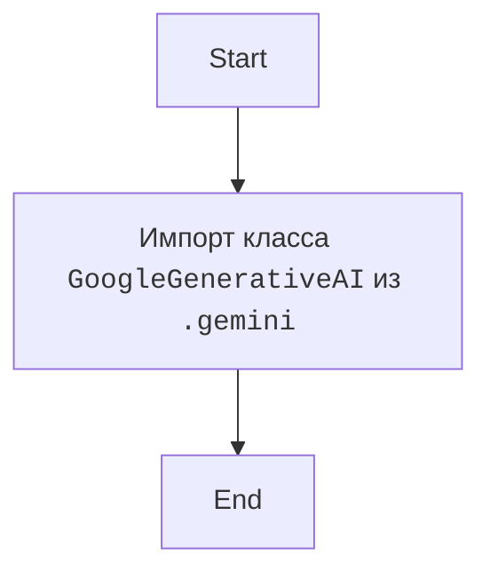

## <алгоритм>

1.  **Импорт `GoogleGenerativeAI`**:
    *   Импортируется класс `GoogleGenerativeAI` из модуля `gemini.py`, находящегося в той же директории, что и текущий файл (благодаря `from .gemini`).

## <mermaid>

## <объяснение>

### Импорты

*   **`from .gemini import GoogleGenerativeAI`**: Этот импорт импортирует класс `GoogleGenerativeAI` из модуля `gemini.py`, находящегося в том же каталоге, что и текущий файл. Использование `.` в начале импорта указывает на относительный импорт, то есть импорт из текущего пакета.

### Классы

*   **`GoogleGenerativeAI`**: Этот класс, судя по названию, предназначен для взаимодействия с API Google Gemini. Он, вероятно, содержит методы для отправки запросов к API и обработки ответов.

### Потенциальные ошибки и области для улучшения

*   **Отсутствие документации**: Код очень лаконичный и не имеет комментариев. Хорошо бы добавить docstring для модуля, объясняющий его назначение.
*  **Неявная зависимость от `gemini.py`**: Код предполагает, что файл `gemini.py` существует в том же каталоге. Было бы полезно добавить обработку исключений, если этот файл не будет найден.

### Взаимосвязи с другими частями проекта

*   Этот импорт делает класс `GoogleGenerativeAI` доступным для использования в других модулях пакета.
*  Предполагается, что модуль `gemini.py` содержит реализацию для работы с Google Gemini API, и этот файл использует ее для доступа к функциональности модели.

### Вывод

Этот код представляет собой простую инициализацию, которая импортирует класс `GoogleGenerativeAI` из модуля `gemini.py`. Этот класс используется для работы с Google Gemini API. В целом, код лаконичен, но требует дополнительной документации и обработки исключений для надежной работы.