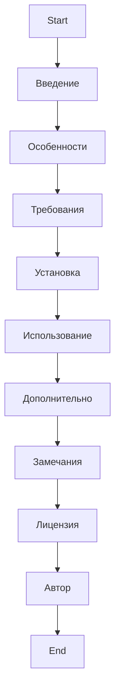
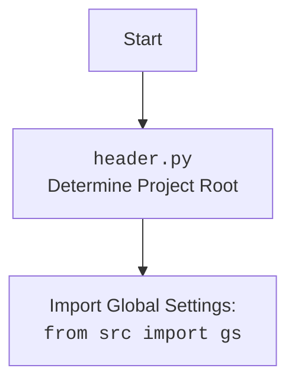

## <алгоритм>

Этот документ представляет собой описание проекта, а не код.  Поэтому алгоритм опишет структуру документа, а не алгоритм выполнения кода.

1.  **Введение**:
    *   Представление проекта и его цели: интеграция с Google Gemini API через класс `GoogleGenerativeAI`.
2.  **Особенности**:
    *   Перечисление основных возможностей проекта.
3.  **Требования**:
    *   Указание необходимых версий Python и библиотек.
    *   Упоминание необходимости наличия API ключа.
4.  **Установка**:
    *   Инструкции по клонированию репозитория и установке зависимостей.
    *   Инструкция по созданию и настройке `config.json` файла.
5.  **Использование**:
    *   Описание инициализации класса `GoogleGenerativeAI`.
    *   Описание методов класса `GoogleGenerativeAI` с их аргументами и возвращаемыми значениями.
    *   Пример использования с демонстрацией работы с изображениями, файлами и диалогами.
6.  **Дополнительно**:
    *   Описание логирования, хранения истории диалогов и обработки ошибок.
7.  **Замечания**:
    *   Указания по замене API ключа и установке необходимых библиотек.
    *   Указание на необходимость наличия файла `test.jpg`.
8.  **Лицензия**:
    *   Указание лицензии проекта.
9.  **Автор**:
    *   Указание автора проекта.

## <mermaid>

## <объяснение>

### Импорты

В данном файле нет импортов, поскольку это не исполняемый код, а описание проекта. Однако, в коде, на который ссылается данное описание, есть следующие импорты:

*   **`google-generativeai`**:  Библиотека для взаимодействия с Google Gemini API.
*   **`requests`**: Библиотека для отправки HTTP-запросов (используется для обработки ошибок).
*    **`grpcio`**: Библиотека для работы с gRPC (используется в `google-generativeai`).
*   **`google-api-core`**: Библиотека для работы с Google API.
*   **`google-auth`**: Библиотека для аутентификации в Google API.
*   **`src.ai.gemini.GoogleGenerativeAI`**: Пользовательский класс для взаимодействия с Google Gemini API.
*   **`src.gs`**: Модуль с глобальными настройками.
*   **`pathlib.Path`**: Модуль для работы с путями к файлам.
*   **`asyncio`**: Библиотека для асинхронного программирования.

### Классы

*   **`GoogleGenerativeAI`**:
    *   Этот класс является основным компонентом проекта и предоставляет интерфейс для взаимодействия с Google Gemini API.
    *   **Методы**:
        *   `__init__`: Инициализирует объект класса.
        *   `ask`: Отправляет текстовый запрос.
        *   `chat`: Отправляет текстовый запрос в чат (с историей).
        *   `describe_image`: Описывает изображение.
        *   `upload_file`: Загружает файл.

### Функции

*   В данном файле нет функций, кроме функций, описанных в разделе "Методы класса `GoogleGenerativeAI`".
*   Функция `main` является примером использования и демонстрирует возможности класса `GoogleGenerativeAI`.

### Переменные

*   **`api_key`**: API-ключ Google Gemini.
*   **`model_name`**: Имя модели Gemini.
*   **`generation_config`**: Конфигурация генерации.
*   **`system_instruction`**: Системная инструкция для модели.
*   **`q`**: Текстовый запрос.
*   **`attempts`**: Количество попыток.
*   **`image`**: Путь к файлу или байты изображения.
*   **`mime_type`**: Mime-тип изображения.
*   **`prompt`**: Текстовый промпт.
*    **`file`**: Путь к файлу, имя файла или файловый объект.
*   **`file_name`**: Имя файла для Gemini API.
*   **`gs`**: Глобальные настройки проекта.

### Потенциальные ошибки и области для улучшения

*   **Описание `config.json`**: Описание `config.json` должно быть более подробным, с указанием всех возможных параметров.
*   **Зависимости**: Необходимо явно указать все версии библиотек в `requirements.txt`.
*   **Обработка ошибок**:  Хотя в описании говорится про обработку ошибок с механизмом повторных попыток, не помешает более подробное описание, какие ошибки могут возникать и как они обрабатываются.
*   **Логирование**: В описании упоминается логирование, но хорошо бы привести примеры того, как это работает и какие файлы создаются.
*   **Примеры**: Примеры в разделе "Использование" можно дополнить, показав больше сценариев использования класса.

### Взаимосвязи с другими частями проекта

*   Данный файл не взаимодействует с другими частями проекта, а лишь описывает его.
*   Класс `GoogleGenerativeAI`, описанный в этом файле, взаимодействует с библиотеками `google-generativeai`, `requests`, `grpcio`, `google-api-core` и `google-auth`, а также с глобальными настройками проекта через `src.gs`.

### Вывод

Этот файл представляет собой подробное описание проекта для интеграции с Google Gemini API. Он содержит описание функциональности, установки, использования и других важных аспектов проекта. Документ хорошо структурирован, но можно добавить больше деталей и примеров для более полного понимания.