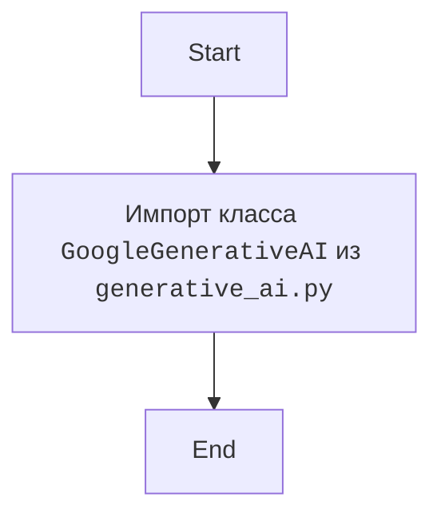
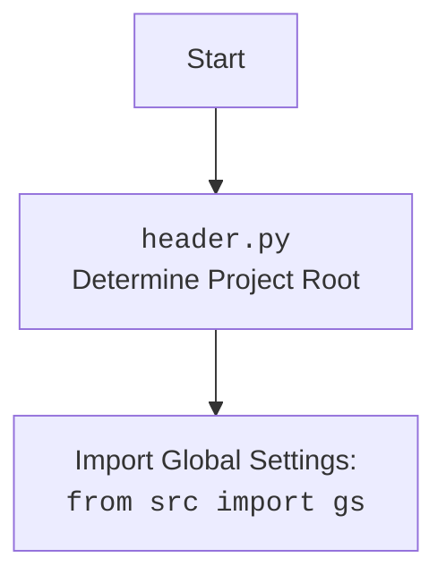

## <алгоритм>

1.  **Импорт `GoogleGenerativeAI`**:
    *   Импортируется класс `GoogleGenerativeAI` из модуля `generative_ai.py`, расположенного в той же директории, что и текущий файл.

## <mermaid>

## <объяснение>

### Импорты

*   **`from .generative_ai import GoogleGenerativeAI`**: Этот импорт импортирует класс `GoogleGenerativeAI` из модуля `generative_ai.py`, который находится в том же каталоге, что и текущий файл (`__init__.py`).

### Классы

*   **`GoogleGenerativeAI`**:  Класс, предоставляющий интерфейс для взаимодействия с Google Gemini API. Он импортируется из модуля `generative_ai.py` и становится доступным для использования через пакет `src.ai.gemini`.

### Потенциальные ошибки и области для улучшения

*   **Отсутствие документации**: Код очень простой и не имеет комментариев. Хорошо бы добавить docstring для модуля, объясняющий его назначение.
*   **Неявная зависимость от `generative_ai.py`**:  Код предполагает, что файл `generative_ai.py` существует в том же каталоге. Было бы полезно добавить обработку исключений, если этот файл не будет найден.

### Взаимосвязи с другими частями проекта

*   Этот файл (`__init__.py`) создает пакет `src.ai.gemini` и делает класс `GoogleGenerativeAI` доступным для импорта в другие модули этого пакета.
*   Модуль `generative_ai.py` содержит реализацию для работы с Google Gemini API, и этот `__init__.py` делает ее доступной через пакет.

### Вывод

Этот код представляет собой простой файл `__init__.py`, который импортирует класс `GoogleGenerativeAI` из модуля `generative_ai.py` и делает его доступным для других частей проекта через пакет `src.ai.gemini`. Код выполняет функцию инициализации пакета и не содержит сложной логики.