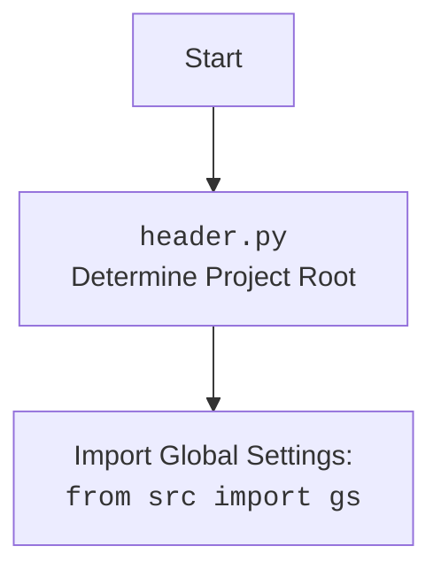

## <алгоритм>

1.  **Импорт модулей**:
    *   Импортируются необходимые модули для работы с Google Generative AI API, включая `google.generativeai`, асинхронность, обработку JSON, путями к файлам, временем, и др.
    *   Импортируются модули для логирования, глобальных настроек, работы с файлами, датами, изображениями и форматирования вывода.

2.  **Определение функций**:
    *   `normalize_text(text: str) -> str`: нормализует текст, заменяя escape-последовательности, типа `
`
    *   `remove_html_blocks(text: str) -> str`: удаляет блоки HTML кода из текста.

3.  **Определение класса `GoogleGenerativeAI`**:
    *   Инициализирует параметры модели (ключ API, имя модели, конфигурацию генерации и системную инструкцию).
    *   Инициализирует пути к файлам для логирования и истории диалогов.
    *   Инициализирует модель `genai.GenerativeModel` и начинает чат с помощью `_start_chat()`.
    *   `_start_chat()`: Запускает чат с учетом системной инструкции.
    *   `clear_history()`: Очищает историю чата и удаляет файл истории.
    *   `_save_chat_history()`: Сохраняет историю чата в JSON файл.
    *   `_load_chat_history()`: Загружает историю чата из JSON файла.
    *   `chat()`: Асинхронно обрабатывает чат-запрос пользователя, сохраняет или загружает историю, и возвращает ответ модели.
    *   `ask()`: Асинхронно отправляет запрос в модель и возвращает ответ, обрабатывая возможные ошибки.
    *   `describe_image()`: Отправляет изображение в Gemini Pro Vision и возвращает текстовое описание.
    *    `upload_file()`: Загружает файл в Gemini.

4.  **Определение `main()`**:
    *   Создает экземпляр `GoogleGenerativeAI`.
    *   Пример использования `describe_image()`:
        *   Проверяет наличие файла с именем `test.jpg`.
        *   Отправляет запрос с промптом в JSON формате и выводит результат.
        *   Отправляет запрос с обычным промптом и выводит результат.
    *   Пример загрузки файла с помощью `upload_file()`.
    *   Пример чата в цикле:
        *   Запрашивает сообщение пользователя.
        *   Отправляет сообщение в чат через `ai.chat()` и выводит ответ.

5.  **Запуск `main()`**:
    *   Запускает `main()` асинхронно.

## <mermaid>

```mermaid
flowchart TD
    Start --> ImportModules[Импорт модулей]
    ImportModules --> DefineFunctions[Определение функций: <code>normalize_text</code>, <code>remove_html_blocks</code>]
    DefineFunctions --> DefineClass[Определение класса <code>GoogleGenerativeAI</code>]
    DefineClass --> InitClass[Инициализация: <br>Пути, <code>genai.configure</code>, <code>GenerativeModel</code>, <code>_chat</code>]
    InitClass --> ClassMethods[Методы класса: <code>_start_chat</code>, <code>clear_history</code>, <code>_save_chat_history</code>, <code>_load_chat_history</code>, <code>chat</code>, <code>ask</code>, <code>describe_image</code>, <code>upload_file</code>]
    ClassMethods --> DefineMain[Определение функции <code>main</code>]
    DefineMain --> CreateAIInstance[Создание экземпляра <code>GoogleGenerativeAI</code>]
    CreateAIInstance --> ImageDescriptionExample[Пример <code>describe_image</code>]
    ImageDescriptionExample --> FileUploadExample[Пример <code>upload_file</code>]
     FileUploadExample --> ChatExample[Пример чата в цикле]
    ChatExample --> RunMain[Запуск <code>main()</code> асинхронно]
    RunMain --> End
```



## <объяснение>

### Импорты

*   **Стандартные библиотеки Python**: `codecs`, `re`, `asyncio`, `time`, `json`, `io.IOBase`, `pathlib.Path`, `typing`, `dataclasses`, `base64`: Обеспечивают базовые функциональности, такие как кодирование текста, работа с регулярными выражениями, асинхронность, работа со временем, JSON, вводом/выводом, путями к файлам, типами данных, классами данных и кодированием base64.
*   **`google.generativeai`**: Основная библиотека для взаимодействия с API Google Gemini.
*   **`requests`**: Библиотека для выполнения HTTP-запросов (используется для обработки ошибок).
*   **`grpc`**: Библиотека для работы с gRPC (используется в `google.generativeai`).
*   **`google.api_core.exceptions`**: Набор исключений для работы с Google API.
*    **`google.auth.exceptions`**: Исключения для работы с аутентификацией Google.
*   **`header`**: Модуль, определяющий корневой путь проекта.
*   **`src.logger.logger`**: Модуль для логирования.
*    **`src.gs`**: Модуль с глобальными настройками.
*   **`src.utils.file`**:  Модуль для работы с файлами (чтение и запись).
*    **`src.utils.date_time`**: Модуль для работы с датой и временем.
*   **`src.utils.jjson`**: Модуль для работы с JSON.
*   **`src.utils.image`**: Модуль для работы с изображениями.
*   **`src.utils.printer`**: Модуль для форматированного вывода.

### Классы

*   **`GoogleGenerativeAI`**:
    *   **Атрибуты**:
        *   `api_key` (str): Ключ API для доступа к Google Gemini API.
        *   `model_name` (str): Имя модели Gemini (по умолчанию "gemini-2.0-flash-exp").
        *   `generation_config` (Dict): Конфигурация генерации (по умолчанию {"response_mime_type": "text/plain"}).
        *   `system_instruction` (Optional[str]): Системная инструкция для модели (например, "Ты - полезный ассистент").
        *   `dialogue_log_path` (Path): Путь к каталогу с логами диалогов (инициализируется в `__post_init__`).
        *    `dialogue_txt_path` (Path): Путь к файлу с логами диалогов (инициализируется в `__post_init__`).
        *   `history_dir` (Path): Путь к каталогу с историей диалогов (инициализируется в `__post_init__`).
        *   `history_txt_file` (Path): Путь к файлу с историей диалогов в текстовом формате (инициализируется в `__post_init__`).
        *   `history_json_file` (Path): Путь к файлу с историей диалогов в формате JSON (инициализируется в `__post_init__`).
        *   `chat_history` (List[Dict]): История чата (инициализируется как пустой список).
        *   `model` (Any): Экземпляр `genai.GenerativeModel` (инициализируется в `__post_init__`).
        *   `_chat` (Any): Экземпляр чата (инициализируется в `__post_init__`).
        *   `MODELS` (List[str]): Список доступных моделей Gemini.
    *   **Методы**:
        *   `__post_init__()`: Инициализирует объект класса после создания, устанавливая пути к файлам и настраивая модель Gemini.
        *    `_start_chat()`: Начинает чат с учетом системной инструкции.
        *   `clear_history()`: Очищает историю чата.
        *    `_save_chat_history()`: Сохраняет историю чата в JSON файл.
        *    `_load_chat_history()`: Загружает историю чата из JSON файла.
        *   `chat()`: Асинхронно обрабатывает чат-запрос.
        *   `ask()`: Отправляет текстовый запрос в модель и возвращает ответ, обрабатывая ошибки.
        *   `describe_image()`: Отправляет запрос на описание изображения в Gemini Pro Vision.
        *   `upload_file()`: Загружает файл в Gemini.

### Функции

*   **`normalize_text(text: str) -> str`**:
    *   **Аргументы**:
        *   `text` (str): Текст для нормализации.
    *   **Возвращаемое значение**:
        *   `str`: Нормализованный текст.
    *   **Назначение**:  Нормализует текст путем декодирования escape-последовательностей Unicode и замены `\
` на `
`.
*   **`remove_html_blocks(text: str) -> str`**:
    *   **Аргументы**:
        *   `text` (str): Текст для обработки.
    *   **Возвращаемое значение**:
        *   `str`: Текст без блоков html.
    *   **Назначение**: Удаляет блоки HTML кода из текста.

### Переменные

*   **`timeout_check`**: Экземпляр класса `TimeoutCheck`.
*  **`__root__`**: Корневой путь проекта (определен в модуле `header`).
*   **`gs`**: Глобальные настройки проекта (импортированы из `src.gs`).

### Потенциальные ошибки и области для улучшения

*   **Обработка ошибок**:  Код содержит довольно много `try-except` блоков, что хорошо. Однако не всегда понятно, что происходит, когда ошибка возникает. В некоторых случаях можно использовать `finally` для выполнения каких-то действий в любом случае.
*   **Логирование**:   Логирование можно улучшить, добавив контекстную информацию, такую как идентификаторы запросов, чтобы упростить отладку.
*    **Сложная логика чата**: Логика обработки истории чата (параметр `flag` в `chat()`) довольно сложная, лучше разбить ее на несколько отдельных функций или вынести в отдельный класс для управления состоянием чата.
*   **Жестко заданные значения**: Некоторые значения (например, количество попыток, таймауты) жестко заданы в коде. Лучше их вынести в конфигурацию.
*   **Много асинхронных операций**: Код использует много `await`, что может быть трудно для понимания. Важно убедиться, что асинхронные операции используются там, где они действительно необходимы.
*    **Магические значения** : В коде есть магические значения, которые лучше заменить на именованные константы.

### Взаимосвязи с другими частями проекта

*   **`header`**: Используется для определения корневого пути, где хранятся логи и история.
*    **`src.logger.logger`**: Используется для логирования всех важных событий и ошибок.
*   **`src.gs`**: Используется для получения ключа API и путей для хранения данных.
*   **`src.utils.*`**: Используются для работы с файлами, JSON, датами, и изображениями.
*   Этот модуль зависит от `google.generativeai` и `requests` для работы с Google Gemini API.

### Вывод

Этот код представляет собой мощный и многофункциональный класс `GoogleGenerativeAI` для работы с Google Gemini API. Он поддерживает различные функции, такие как текстовый чат, запросы на описание изображения, загрузку файлов, а также управление историей чата. Код хорошо структурирован, но можно улучшить обработку ошибок, логирование, и упростить логику чата.