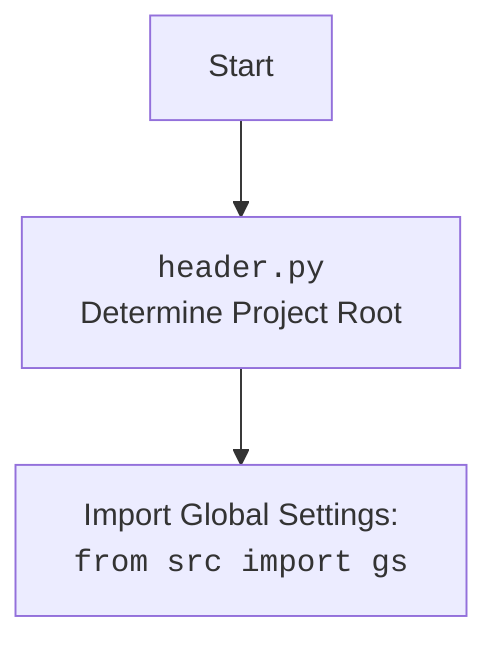

## <алгоритм>

1.  **Импорт модулей**:
    *   Импортируются модули `sys`, `json`, `packaging.version.Version` и `pathlib.Path`.
2.  **Определение функции `set_project_root`**:
    *   Функция `set_project_root` находит корневую директорию проекта, начиная с директории текущего файла, и добавляет её в `sys.path`.
    *   Функция принимает кортеж `marker_files`, по умолчанию `('__root__', '.git')`, который используется для идентификации корневой директории проекта.
3.  **Вызов `set_project_root`**:
    *   Вызывается функция `set_project_root()` и результат сохраняется в переменной `__root__`.
4.  **Импорт глобальных настроек**:
    *   Импортируется переменная `gs` из пакета `src` (предположительно, содержащая глобальные настройки приложения).
5.  **Загрузка конфигурации**:
    *   Попытка загрузить конфигурацию из `config.json`, расположенного в `src` директории относительно корневой директории проекта.
    *   Обработка исключений `FileNotFoundError` и `json.JSONDecodeError`, если файл не найден или не является валидным JSON.
6. **Загрузка README.MD**:
    * Попытка загрузить содержимое из файла `README.MD` расположенного в `src` директории относительно корня проекта.
    *  Обработка исключений `FileNotFoundError` и `json.JSONDecodeError`.
7.  **Инициализация глобальных переменных**:
    *   Инициализация глобальных переменных `__project_name__`, `__version__`, `__doc__`, `__details__`, `__author__`, `__copyright__` и `__cofee__` на основе загруженной конфигурации или значений по умолчанию.

## <mermaid>

```mermaid
flowchart TD
    Start --> ImportModules[Импорт модулей: <code>sys</code>, <code>json</code>, <code>Version</code>, <code>Path</code>]
    ImportModules --> DefineFunction[Определение функции <code>set_project_root</code>]
    DefineFunction --> GetCurrentPath[Определение абсолютного пути к текущему каталогу]
    GetCurrentPath --> InitializeRoot[Инициализация <code>__root__</code> как текущий путь]
     InitializeRoot --> IterateParents[Итерация по родительским каталогам]
    IterateParents -- MarkerExists --> SetRoot[Установка родительского каталога как <code>__root__</code> и выход из цикла]
    IterateParents -- MarkerDoesNotExist --> IterateParents
     SetRoot --> CheckSysPath[Проверка наличия <code>__root__</code> в <code>sys.path</code>]
    CheckSysPath -- NotInSysPath --> AddSysPath[Добавление <code>__root__</code> в <code>sys.path</code>]
    CheckSysPath -- InSysPath --> ReturnRoot[Возврат <code>__root__</code>]
    AddSysPath --> ReturnRoot
    ReturnRoot --> CallFunction[Вызов <code>set_project_root()</code> и сохранение результата в <code>__root__</code>]
    CallFunction --> ImportGS[Импорт <code>gs</code> из <code>src</code>]
    ImportGS --> LoadConfig[Загрузка конфигурации из <code>config.json</code>]
        LoadConfig --> LoadReadme[Загрузка <code>README.MD</code>]
    LoadReadme --> InitGlobalVars[Инициализация глобальных переменных]
    InitGlobalVars --> End
```



## <объяснение>

### Импорты

*   **`sys`**: Модуль для доступа к системным переменным и функциям, в частности `sys.path`.
*   **`json`**: Модуль для работы с JSON-данными.
*   **`packaging.version.Version`**:  Используется для работы с версиями пакетов (в данном коде не используется).
*   **`pathlib.Path`**: Модуль для работы с путями в файловой системе.
*   **`src`**: Импортирует пакет `src`.
*    **`src.gs`**: Импортирует  глобальные настройки из `src`.

### Функции

*   **`set_project_root(marker_files: tuple[str, ...] = ('__root__', '.git')) -> Path`**:
    *   **Аргументы**:
        *   `marker_files` (tuple[str, ...], optional): Кортеж с именами файлов или каталогов, которые используются для определения корневой директории проекта. По умолчанию `('__root__', '.git')`.
    *   **Возвращаемое значение**:
        *   `Path`: Абсолютный путь к корневой директории проекта. Если корневая директория не найдена, возвращается путь к каталогу, в котором находится текущий файл.
    *   **Назначение**: Функция ищет корневую директорию проекта, двигаясь вверх по иерархии каталогов, пока не найдет один из `marker_files`. Затем она добавляет этот путь в `sys.path`, чтобы Python мог импортировать модули из этой директории.

### Переменные

*   **`__root__` (Path)**: Абсолютный путь к корневой директории проекта.
*   **`config` (dict | None)**: Словарь, содержащий конфигурационные параметры, загруженные из `config.json`.
*    **`doc_str` (str | None)**: Строка, содержащая содержимое файла `README.MD`.
*   **`__project_name__` (str)**: Название проекта (по умолчанию "hypotez").
*   **`__version__` (str)**: Версия проекта (по умолчанию "").
*   **`__doc__` (str)**: Документация проекта (по умолчанию "").
*    **`__details__` (str)**: Детали проекта (по умолчанию "").
*   **`__author__` (str)**: Автор проекта (по умолчанию "").
*    **`__copyright__` (str)**: Авторское право проекта (по умолчанию "").
*    **`__cofee__` (str)**: Строка с предложением поддержать разработчика чашкой кофе.

### Потенциальные ошибки и области для улучшения

*   **Обработка ошибок**: Код обрабатывает ошибки при загрузке `config.json` и `README.MD`, но просто пропуская их (`...`). Лучше логировать эти ошибки, используя `logger.error`.
*   **Жесткие пути**: Пути к файлам `config.json` и `README.MD` жестко закодированы. Можно сделать их настраиваемыми через переменные окружения или параметры запуска.
*   **Зависимость от структуры проекта**: Код предполагает, что файл `config.json` находится в `src` директории, относительно корневой директории. Это не всегда может быть так.
*    **Отсутствие типов**: Некоторые переменные не имеют явного указания типа, например `config`.

### Взаимосвязи с другими частями проекта

*   Этот файл является частью пакета `src.ai.gemini`.
*   Этот модуль использует `src.gs` для получения пути к корню проекта и для загрузки файлов конфигурации.
*    Этот модуль использует модуль `header` для настройки корневого пути проекта.
*   Глобальные переменные, определенные в этом файле, предоставляют метаданные проекта и используются в других частях проекта.

### Вывод

Этот код инициализирует переменные проекта, загружая их из файла `config.json` и `README.MD`.  Функция `set_project_root` определяет корневой каталог проекта и добавляет его в `sys.path`. В целом код выполняет важную функцию настройки и обеспечивает метаданными для всего проекта.