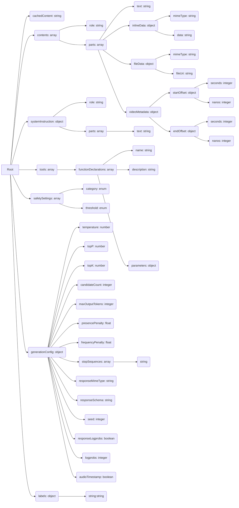

## <алгоритм>

Этот документ описывает структуру JSON, а не код. Поэтому алгоритм опишет структуру JSON, а не алгоритм выполнения кода.

1.  **Корневой объект**:
    *   Объект JSON, содержащий все параметры запроса.
    *   Включает поля `cachedContent`, `contents`, `systemInstruction`, `tools`, `safetySettings`, `generationConfig`, `labels`.
2.  **`cachedContent`**:
    *   Строка, представляющая кешированное содержимое (описание не ясно).
3.  **`contents`**:
    *   Массив объектов, представляющих историю диалога (или ввод).
    *   Каждый объект содержит:
        *   `role`: Строка, определяющая роль (например, "user", "model").
        *   `parts`: Массив объектов, представляющих контент сообщения.
            *  Каждый объект `parts` содержит  только одно из следующих полей:
                *   `text`: Строка, содержащая текст сообщения.
                *   `inlineData`: Объект, содержащий `mimeType` и `data` для inline-данных (например, изображение).
                *   `fileData`: Объект, содержащий `mimeType` и `fileUri` для данных из файла.
                *   `videoMetadata`: Метаданные видео с `startOffset` и `endOffset` (секунды и наносекунды).
4.  **`systemInstruction`**:
    *   Объект, представляющий системные инструкции для модели.
    *   Содержит:
        *   `role`: Строка, определяющая роль инструкции (например, "user").
        *   `parts`: Массив объектов, содержащих текст инструкции.
5.  **`tools`**:
    *   Массив объектов, определяющих инструменты, доступные модели.
    *   Каждый объект содержит:
        *   `functionDeclarations`: Массив объектов, описывающих функции.
            *   Каждый объект содержит `name`, `description`, `parameters` (объект)  функции.
6.  **`safetySettings`**:
    *   Массив объектов, определяющих настройки безопасности.
    *   Каждый объект содержит:
        *   `category`: Категория безопасности (enum, пример: `HarmCategory`).
        *   `threshold`: Порог блокировки (enum, пример `HarmBlockThreshold`).
7.  **`generationConfig`**:
    *   Объект, содержащий конфигурацию генерации.
    *   Включает:
        *  `temperature`: Температура (number).
        *   `topP`: Top P (number).
        *  `topK`: Top K (number).
        *  `candidateCount`: Количество кандидатов (integer).
        *   `maxOutputTokens`: Максимальное количество токенов (integer).
        *   `presencePenalty`: Штраф за присутствие (float).
        *    `frequencyPenalty`: Штраф за частоту (float).
        *   `stopSequences`: Массив стоп-последовательностей (string).
        *  `responseMimeType`: Mime-тип ответа (string).
        *   `responseSchema`: Схема ответа (string, `schema`).
        *   `seed`: Seed для воспроизводимости (integer).
        *   `responseLogprobs`: Возвращать ли лог-вероятности (boolean).
        *    `logprobs`: Количество лог-вероятностей (integer).
        * `audioTimestamp` :  Возвращать ли таймстемп аудио (boolean).
8.  **`labels`**:
    *   Объект, представляющий пользовательские метки (ключ-значение `string` : `string`).

## <mermaid>

## <объяснение>

### Импорты

В данном документе нет импортов, поскольку это не код, а описание структуры JSON.

### Классы

В данном документе нет классов.

### Функции

В данном документе нет функций.

### Переменные

*   **`cachedContent`**: Строка.
*    **`contents`**: Массив объектов.
    *   **`role`**: Строка.
    *   **`parts`**: Массив объектов.
        *   **`text`**: Строка.
        *   **`inlineData`**: Объект.
             *    **`mimeType`**: Строка.
             *    **`data`**: Строка.
        *    **`fileData`**: Объект.
             *   **`mimeType`**: Строка.
             *   **`fileUri`**: Строка.
        *    **`videoMetadata`**: Объект.
             *    **`startOffset`**: Объект.
                  *    **`seconds`**: Целое число.
                  *   **`nanos`**: Целое число.
              *   **`endOffset`**: Объект.
                  *   **`seconds`**: Целое число.
                  *    **`nanos`**: Целое число.
*   **`systemInstruction`**: Объект.
    *   **`role`**: Строка.
    *   **`parts`**: Массив объектов.
        *   **`text`**: Строка.
*   **`tools`**: Массив объектов.
    *   **`functionDeclarations`**: Массив объектов.
        *   **`name`**: Строка.
        *   **`description`**: Строка.
        *   **`parameters`**: Объект.
*    **`safetySettings`**: Массив объектов.
    *   **`category`**: Enum (например, `HarmCategory`).
    *   **`threshold`**: Enum (например, `HarmBlockThreshold`).
*   **`generationConfig`**: Объект.
    *   **`temperature`**: Число.
    *   **`topP`**: Число.
    *   **`topK`**: Число.
    *    **`candidateCount`**: Целое число.
    *    **`maxOutputTokens`**: Целое число.
    *    **`presencePenalty`**: Число с плавающей запятой.
    *    **`frequencyPenalty`**: Число с плавающей запятой.
    *    **`stopSequences`**: Массив строк.
    *    **`responseMimeType`**: Строка.
    *    **`responseSchema`**: Строка.
    *    **`seed`**: Целое число.
    *    **`responseLogprobs`**: Логическое значение.
    *    **`logprobs`**: Целое число.
    *    **`audioTimestamp`**: Логическое значение.
*  **`labels`**: Объект типа `string` : `string`.

### Потенциальные ошибки и области для улучшения

*   **`cachedContent`**: Назначение `cachedContent` не ясно. Стоит добавить описание или убрать его.
*   **Enum Types**: В `safetySettings` указано, что `category` и `threshold` являются enum, но не приведено никаких примеров. Лучше добавить примеры возможных значений.
*  **Отсутствие описания параметров**: В структуре JSON не хватает описаний назначения некоторых параметров, таких как  `topP`, `topK`, `presencePenalty`, `frequencyPenalty` и т.д.
*   **Union Field Data**: Описание полей в `parts` говорит, что `data` может быть одним из типов `text`, `inlineData`, `fileData`. Это нужно подчеркнуть, чтобы было понятно, что в одно время может быть использовано только одно из этих полей.
*   **`responseSchema`**: Тип `schema` для `responseSchema` не определен.

### Взаимосвязи с другими частями проекта

Этот документ описывает структуру JSON, которая используется для взаимодействия с Google Gemini API. Он определяет структуру запроса, который отправляется в API, и структуру ответа.

### Вывод

Этот документ представляет собой описание структуры JSON для запросов к Google Gemini API. Он включает в себя различные параметры и настройки, такие как история диалогов, системные инструкции, параметры безопасности и конфигурацию генерации. Документ хорошо структурирован, но требует некоторых уточнений, например, описание назначения всех параметров, примеры `enum`, и подробное описание типа `schema`.