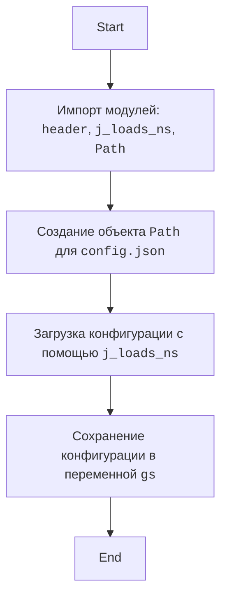
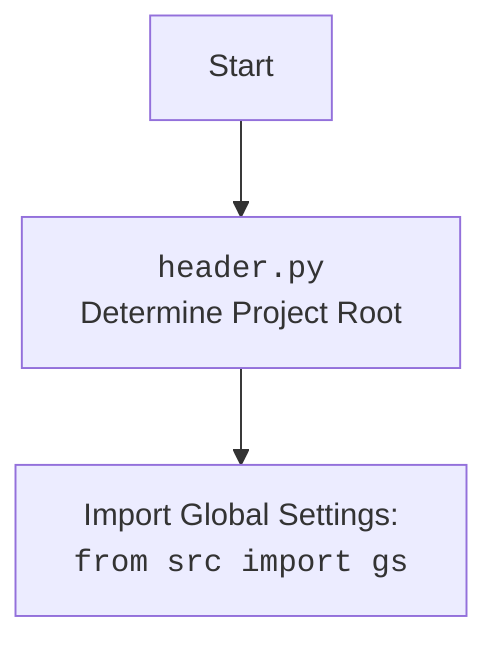

## <алгоритм>

1.  **Импорт модулей**:
    *   Импортируется модуль `header` (предположительно, для определения корня проекта).
    *   Импортируется функция `j_loads_ns` из `src.utils.jjson` для безопасной загрузки JSON-файлов.
    *   Импортируется класс `Path` из `pathlib` для работы с путями к файлам.

2.  **Загрузка конфигурации**:
    *   Создается объект `Path` для файла `config.json`.
    *   Вызывается функция `j_loads_ns` с путем к файлу `config.json` для загрузки конфигурации.
    *   Результат загрузки сохраняется в переменной `gs`.

## <mermaid>

## <объяснение>

### Импорты

*   **`header`**: Этот модуль, скорее всего, используется для определения корневого каталога проекта. Он может содержать логику для поиска или определения пути к корню проекта, что необходимо для правильной работы с файлами конфигурации.
*   **`src.utils.jjson.j_loads_ns`**: Эта функция используется для безопасной загрузки данных из JSON-файла. `j_loads_ns` (предположительно, "json loads namespace") может включать логику для обработки ошибок и предоставления более безопасного способа загрузки, чем стандартный `json.load`. Она также может возвращать результат в виде именованного пространства имен, чтобы упростить доступ к данным конфигурации.
*   **`pathlib.Path`**: Этот класс используется для создания объектов, представляющих пути к файлам и каталогам. Он предоставляет удобные методы для работы с путями.

### Переменные

*   **`gs`**: Это переменная, в которой хранится загруженная конфигурация из файла `config.json`. Тип этой переменной будет зависеть от структуры JSON-файла, но это, скорее всего, словарь (dict) или объект, подобный словарю, если `j_loads_ns` возвращает именованное пространство имен. Эта переменная будет использоваться для доступа к различным параметрам конфигурации в других частях проекта.

### Функции

*   **`j_loads_ns`**: Эта функция принимает путь к JSON-файлу и возвращает загруженные данные в виде именованного пространства имен. Она скрывает подробности загрузки JSON и гарантирует, что конфигурация загружается безопасно.

### Потенциальные ошибки и улучшения

*   **Отсутствие обработки ошибок**: В коде не предусмотрена обработка ошибок, которые могут возникнуть при загрузке файла конфигурации. Например, если файл `config.json` не существует или имеет неправильный формат, программа может завершиться с ошибкой. Необходимо добавить блок `try-except` для обработки этих ситуаций и логировать ошибки с помощью `logger.error`.
*   **Зависимость от имени файла**: Код жестко завязан на имя файла `config.json`. Возможно, следует сделать имя файла настраиваемым через переменные окружения или параметры запуска.
*   **Документация**: Нет документации для этого модуля (хотя и есть docstring), что затрудняет понимание его назначения и использования. Было бы полезно добавить более подробное описание в docstring.
*   **Относительный путь**: Использование относительного пути 'config.json' может привести к проблемам, если скрипт запускается из другого каталога. Лучше использовать `Path('config.json').absolute()` или подобный метод для работы с абсолютными путями.

### Взаимосвязи с другими частями проекта

*   Переменная `gs` предоставляет общие настройки для всего проекта.
*   Модуль `header` используется для определения корня проекта, что важно для других модулей, работающих с файлами.
*   Модуль `src.utils.jjson` предоставляет утилиту для работы с JSON, которая может использоваться и в других частях проекта.

### Вывод

В целом, этот код представляет собой модуль, который загружает общие параметры конфигурации из файла `config.json`. Для его улучшения следует добавить обработку ошибок, возможность настройки пути к файлу, документацию и возможность использования абсолютных путей.