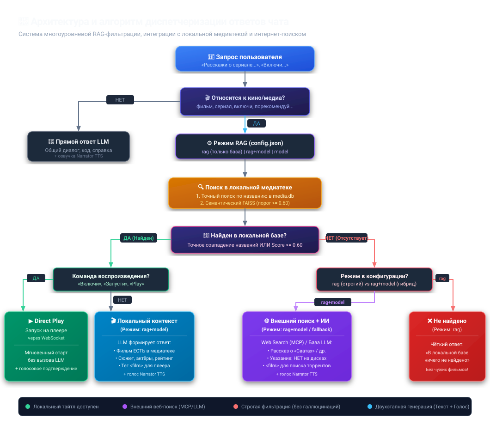

# 🧠 Архитектура и алгоритм диспетчеризации ответов чата

## 📋 Общие сведения

Документ описывает логику и алгоритм обработки пользовательских запросов в чате голосового ассистента медиатеки (`kino.davidka.net`).

Система объединяет:
1. **Локальную базу метаданных** (`media.db`) с информацией о фильмах на подключенных дисках.
2. **Семантический векторный индекс** (`media_rag.db` на базе Google Gemini Embeddings + FAISS).
3. **MCP-инструменты веб-поиска** (Google Grounding, Playwright MCP, LangChain MCP).
4. **Двухэтапную генерацию** (Chat Model формирует структурированный ответ для экрана, Narrator Model синтезирует лаконичную речь для голосового движка TTS).

---

## 🗺️ Графическая схема алгоритма (Flowchart)

---

## ⚙️ Режимы работы (RAG Modes в `config.json`)

В конфигурации приложения (`config.json` -> `rag.mode`) доступны три режима:

### 1. `rag+model` — Гибридный режим (Рекомендуемый / Основной)
* **Принцип:** Сначала опрашивается локальная база.
* **Если фильм найден в локальной медиатеке:** Данные карточки передаются в системный контекст LLM. Модель формулирует связный ответ, отмечает, что фильм **есть на локальных дисках**, описывает сюжет и оборачивает название в тег `<film>Название</film>` для автоматической привязки к плееру.
* **Если фильм отсутствует на дисках:** Локальный RAG возвращает пустой результат. Срабатывает fallback на веб-поиск (MCP / Gemini Grounding) или внутреннюю базу знаний LLM. Ассистент подробно рассказывает о фильме/сериале, явно указывает, что тайтл **пока отсутствует в медиатеке**, и тегирует его `<film>Название</film>`, чтобы в интерфейсе появились кнопки скачивания через торренты или просмотра онлайн.
* **Свободные запросы и рекомендации** (*«Найди боевик на вечер»*): LLM анализирует подходящие по жанру локальные тайтлы и формулирует живую рекомендацию.

### 2. `rag` — Строгий режим локальной базы (Без вызова внешней LLM)
* **Принцип:** Работает исключительно с базой `media.db` и векторным индексом.
* **Если фильм найден:** Возвращается карточка медиа (Direct RAG).
* **Если фильм не найден:** Возвращается чёткое сообщение `«❌ В локальной медиатеке ничего не найдено по вашему запросу»` (без подмешивания несвязанных случайных фильмов).

### 3. `model` — Прямой режим LLM (Без локальной базы)
* **Принцип:** Запрос направляется напрямую в модель и веб-поисковик в обход локальной базы данных.

---

## 📊 Матрица сценариев обработки запросов

| Сценарий | Пример запроса | Алгоритм обработки | Результат работы |
| :--- | :--- | :--- | :--- |
| **Фильм есть в локальной базе** | *«Расскажи о фильме А зори здесь тихие»* | 1. Точный поиск в `media.db` (Score 1.0) или FAISS (Score $\ge 0.60$). 2. Передача контекста в LLM. | Ассистент рассказывает о фильме, указывает, что он **доступен в медиатеке**, и оборачивает в `<film>А зори здесь тихие</film>`. |
| **Фильма нет в базе (внешний тайтл)** | *«Расскажи о сериале Сваты»* | 1. Локальный RAG отсекает нерелевантные записи (порог $< 0.60$). 2. Fallback на Web Search / Gemini Grounding. | Ассистент рассказывает о сериале, отмечает, что **на дисках его нет**, и добавляет тег `<film>Сваты</film>` (кнопка загрузки торрента). |
| **Команда воспроизведения** | *«Включи А зори здесь тихие»* | 1. Определение intent `play`. 2. Проверка пути файла на подключенном диске. 3. WebSocket broadcast в плеер (`play_file_by_path`). | Мгновенный запуск в плеере (Direct Play) без ожидания генерации текста LLM. |
| **Запрос подборки / настроения** | *«Найди захватывающий детектив»* | 1. RAG извлекает подходящие по жанру тайтлы. 2. LLM ранжирует и формирует диалоговую подборку. | Список рекомендаций с кратким обоснованием «почему стоит посмотреть». |
| **Случайный выбор** | *«Случайный фильм» / «Карусель»* | 1. Выбор случайной записи `ORDER BY RANDOM()` из `media.db` среди доступных дисков. | Карточка фильма + опциональный автозапуск в плеере. |

---

## 🎯 Пороги семантического сходства (Cosine Similarity)

При использовании векторных эмбеддингов Gemini (`gemini-embedding-2` / `text-embedding-004`, 3072 размерности):
* $\text{Score} \ge 0.80$ — Полное смысловое / точное совпадение тайтла.
* $0.60 \le \text{Score} < 0.80$ — Высокая тематическая релевантность (подходит для контекста LLM).
* $0.35 \le \text{Score} < 0.60$ — Общий контекст кинематографа (отсекается при поиске конкретного фильма).
* $\text{Score} < 0.35$ — Случайный фоновый шум.

Порог фильтрации в `rag_search_tool` установлен на **`0.60`**, что гарантирует отсутствие ложных срабатываний и «галлюцинаций» при запросе фильмов, которых нет в медиатеке.
