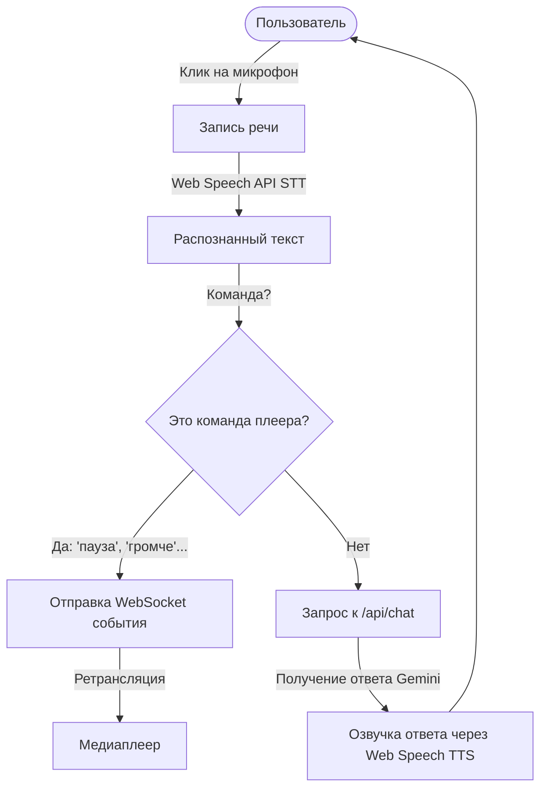

# Модуль веб-пульта ДУ (/rc)

Этот модуль предоставляет веб-интерфейс пульта дистанционного управления для медиаплеера с поддержкой голосовых команд и искусственного интеллекта.

## Структура файлов
* `index.html` — основная страница веб-пульта, включающая UI кнопки управления, лог голосовых сообщений и встроенный JavaScript для Web Speech API и WebSocket клиента.

## Принцип работы и Workflow

### 1. Подключение
Пульт подключается к бэкенду по адресу `ws://<хост>/api/control/ws?role=remote&room=default`.
При успешном подключении он автоматически запрашивает у сервера текущее состояние плеера и плейлист (если плеер уже онлайн).

### 2. Голосовое управление (Speech-to-Text)
Использует встроенный в браузер движок `webkitSpeechRecognition`. 
* Локальные команды управления (разбираются регулярными выражениями):
  * **Пауза / Стоп** -> `{ action: 'pause' }`
  * **Плей / Продолжить** -> `{ action: 'play' }`
  * **Громче** -> `{ action: 'set_volume', level: volume + 0.2 }`
  * **Тише** -> `{ action: 'set_volume', level: volume - 0.2 }`
  * **Следующий / Предыдущий** -> `{ action: 'next' }` / `{ action: 'prev' }`
* Другие фразы (запросы рекомендаций, вопросы) пересылаются на бэкенд `/api/chat`.

### 3. Синтез речи (Text-to-Speech)
Ответы от AI-модели Gemini зачитываются голосом с помощью браузерного API `SpeechSynthesisUtterance` с установленным языком `ru-RU`.
